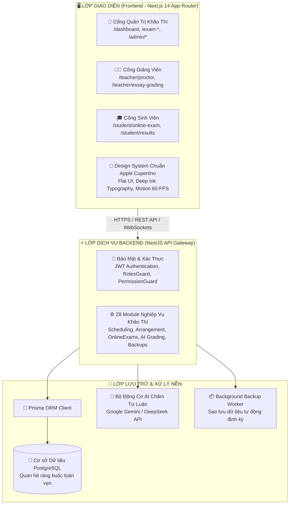
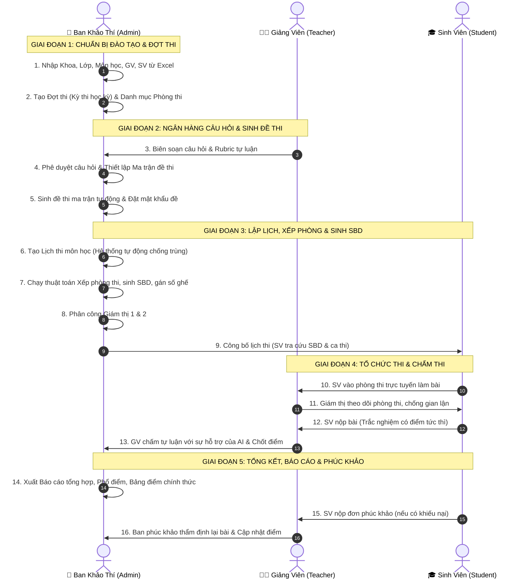

# 00. TỔNG QUAN HỆ THỐNG QUẢN LÝ KHẢO THÍ (EXAM MANAGEMENT SYSTEM)

Hệ Thống Quản Lý Khảo Thí Sinh Viên (Exam Management System) là giải pháp phần mềm cấp doanh nghiệp (Enterprise Grade) hỗ trợ tự động hóa toàn bộ chu trình khảo thí học đường — từ khâu quy hoạch đào tạo, lập lịch thi, sinh đề thi tự động, giám sát trực tuyến chống gian lận đến chấm thi tự luận tích hợp trí tuệ nhân tạo (AI) và xuất báo cáo thống kê chuyên sâu.

---

## 🏗️ 1. Kiến Trúc Kỹ Thuật Tổng Thể

Hệ thống được xây dựng trên kiến trúc Client-Server hiện đại, đáp ứng năng lực phục vụ đồng thời hàng nghìn thí sinh làm bài trực tuyến:

---

## 👥 2. Các Nhóm Vai Trò & Ma Trận Phân Quyền (Roles)

Hệ thống quản lý chặt chẽ theo 3 nhóm đối tượng người dùng chính:

| Vai trò | Mã hệ thống | Trách nhiệm chính trong chu trình khảo thí |
| :--- | :--- | :--- |
| **Quản trị viên / Cán bộ Khảo thí** | `ADMIN` | Quản trị toàn hệ thống; thiết lập phân quyền RBAC; quản lý danh mục đào tạo (Khoa, Lớp, Môn học); lập đợt thi, phòng thi, lịch thi; chạy thuật toán xếp phòng & sinh SBD; duyệt đề thi; xuất báo cáo tổng hợp; sao lưu dữ liệu. |
| **Giảng viên / Cán bộ Coi thi & Chấm thi** | `TEACHER` | Xem ca coi thi được phân công; giám sát phòng thi trực tuyến thời gian thực (nhắc nhở, cảnh cáo, xử lý vi phạm); chấm bài thi tự luận theo tiêu chí Rubric kết hợp gợi ý từ AI; thẩm định và giải quyết đơn phúc khảo bài thi. |
| **Thí sinh / Sinh viên** | `STUDENT` | Tra cứu lịch thi, phòng thi, số báo danh; tham gia thi trực tuyến (trắc nghiệm và tự luận); tra cứu điểm số, phổ điểm và lịch sử bài làm; gửi đơn phúc khảo trực tuyến khi có thắc mắc về kết quả. |

---

## 🔑 3. Tài Khoản Diễn Tập & Kiểm Thử Mặc Định

Để cán bộ, giảng viên và quản trị viên làm quen với hệ thống, hệ thống đã khởi tạo sẵn bộ tài khoản mẫu (Seed Data) phản ánh đúng 3 vai trò:

| Vai trò | Tên đăng nhập / Email | Mật khẩu mặc định | Mục đích sử dụng |
| :--- | :--- | :--- | :--- |
| **Quản trị viên (Admin)** | `admin@exam.local` | `Admin@123` | Quản trị cao nhất, có toàn quyền trên toàn hệ thống |
| **Giảng viên 1 (Teacher)** | `teacher1@exam.local` | `Teacher@123` | Coi thi ca sáng, chấm thi tự luận môn Cơ sở dữ liệu |
| **Giảng viên 2 (Teacher)** | `teacher2@exam.local` | `Teacher@123` | Coi thi ca chiều, thẩm định phúc khảo |
| **Sinh viên 1 (Student)** | `student1@exam.local` | `Student@123` | Thí sinh thuộc Khoa Công nghệ thông tin (Đã có lịch thi) |
| **Sinh viên 2 (Student)** | `student2@exam.local` | `Student@123` | Thí sinh đã hoàn thành bài thi (Xem điểm và gửi phúc khảo) |

> [!CAUTION]
> Khi đưa hệ thống vào môi trường Production (Chính thức), Quản trị viên **BẮT BUỘC** phải đổi mật khẩu của tài khoản `admin@exam.local` hoặc vô hiệu hóa các tài khoản demo để đảm bảo an toàn tuyệt đối.

---

## 🔄 4. Chu Trình Nghiệp Vụ Khảo Thí Khép Kín (5 Giai Đoạn)

Quy trình tổ chức một kỳ thi chính quy trên hệ thống tuân theo 5 giai đoạn liên hoàn:

---

## 🎨 5. Tiêu Chuẩn Giao Diện & Trải Nghiệm Người Dùng (UX/UI Standard)

Hệ thống tuân thủ nghiêm ngặt **Quy tắc Thiết kế Giao diện Apple Crisp White** và **Manifesto Phẳng Chống Rối Rắm**:
1. **Nền Canvas Sạch Sẽ (`#FBFBFD`)**: Nền toàn trang giữ màu trắng sáng ngà tinh khiết, các thẻ Card và Bảng dữ liệu có viền hairline mờ `border-slate-200/90` kèm bóng đổ nổi khối mềm mại.
2. **Hệ Thống Màu Chữ Deep Ink 4 Tầng**: Đảm bảo độ tương phản cao, chống mỏi mắt cho cán bộ và thí sinh khi thao tác làm bài trong thời gian dài:
   - Chữ chính (`.text-main`): `#020617` (Light) / `#F8FAFC` (Dark).
   - Chữ phụ (`.text-sub`): `#111827` (Light) / `#E2E8F0` (Dark).
   - Chú thích (`.text-helper`): `#1F2937` (Light) / `#CBD5E1` (Dark).
3. **5 Nhóm Trạng Thái Semantic Rõ Ràng**:
   - ⚪ **Trung tính** (Nháp, Chưa bắt đầu): Nền `#F1F5F9`, Chữ `#334155`.
   - 🔵 **Thông tin / Đang diễn ra**: Nền `#EFF6FF`, Chữ `#1D4ED8`.
   - 🟡 **Chờ xử lý / Chờ duyệt**: Nền `#FFFBEB`, Chữ `#B45309`.
   - 🟢 **Thành công / Hoàn thành / Đã duyệt**: Nền `#F0FDF4`, Chữ `#15803D`.
   - 🔴 **Lỗi / Bị từ chối / Vi phạm**: Nền `#FEF2F2`, Chữ `#B91C1C`.
4. **Không Thay Đổi Kích Thước Bất Thường (Chống Giật Layout)**: Khi các nút bấm hoặc form chuyển sang trạng thái đang tải (`isLoading`), nút giữ nguyên nhãn chữ và hiển thị spinner xoay tại tâm, không phình to giao diện.

---

> [!TIP]
> Bạn hãy tiếp tục khám phá tài liệu chi tiết của từng vai trò tại thanh điều hướng bên trái hoặc danh mục trong trang [README.md](./README.md).
