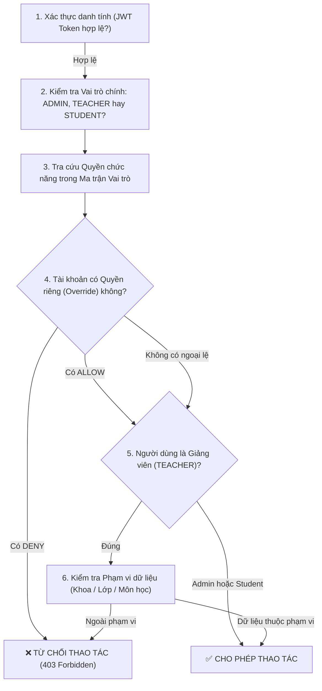

# 01. HƯỚNG DẪN ĐĂNG NHẬP, BẢO MẬT & PHÂN QUYỀN TRUY CẬP (RBAC)

Tài liệu này hướng dẫn chi tiết quy trình đăng nhập an toàn và quản trị ma trận phân quyền truy cập người dùng (**Role-Based Access Control - RBAC**) tại trang Quản trị Hệ thống (`/admin/access-control`).

---

## 🔐 1. Quy Trình Đăng Nhập & Bảo Mật Phiên Làm Việc

### Các bước đăng nhập Localhost (Môi trường Thử nghiệm):
1. Mở trình duyệt web (Google Chrome, Microsoft Edge, Firefox phiên bản mới nhất).
2. Truy cập địa chỉ hệ thống: **`http://localhost:3000/login`**
3. Trên giao diện đăng nhập, bên dưới nút xanh Google, bấm vào dòng: **"Đăng nhập tài khoản nội bộ"** (có icon hình người và mũi tên mở rộng).
4. Khung đăng nhập nội bộ mở ra, bạn nhập thông tin tài khoản Quản trị viên:
   - **Tên đăng nhập (Username)**: `admin` (hoặc email: `admin@school.edu.vn`)
   - **Mật khẩu (Password)**: `admin123`
5. Nhấn nút **"Đăng nhập"**.
6. Hệ thống xác thực thông tin qua NestJS API và cấp phiên làm việc an toàn bằng **JWT (JSON Web Token)**, sau đó tự động điều hướng bạn vào thẳng **Bảng điều khiển Quản trị (`/dashboard`)**.

> [!NOTE]
> Nếu bạn muốn đăng nhập thử nghiệm bằng vai trò khác để kiểm tra giao diện:
> - Giảng viên: Tên đăng nhập `GV001`, Mật khẩu: `GV001` (chuyển về `/teacher/assignments`).
> - Sinh viên: Tên đăng nhập `sv001`, Mật khẩu: `123456` (chuyển về `/student/exam-schedule`).

---

## 🛡️ 2. Mô Hình Quyết Định Quyền Truy Cập 6 Cấp Độ

Mỗi khi người dùng thực hiện một hành động (Click menu, mở trang, xem danh sách, thêm/sửa/xóa dữ liệu), hệ thống backend sẽ tính toán quyền lực thực tế (**Effective Permissions**) qua 6 bước nghiêm ngặt:

---

## 🎛️ 3. Quản Trị Phân Quyền Tại `/admin/access-control`

Khu vực này bao gồm 3 phân hệ độc lập:

### Phân hệ 1: Quyền Theo Vai Trò (Role Permissions)
* **Ý nghĩa**: Cấu hình các quyền mặc định cho toàn bộ tài khoản có cùng vai trò trong hệ thống.
* **Cách thực hiện**:
  1. Chọn tab **"Quyền theo vai trò"**.
  2. Chọn vai trò cần cấu hình: `Quản trị viên`, `Giảng viên` hoặc `Sinh viên`.
  3. Bật/Tắt các checkbox tương ứng với từng chức năng (Ví dụ: `QUESTION_BANK_VIEW`, `QUESTION_BANK_MANAGE`, `EXAM_REPORT_EXPORT`).
  4. Nhập **Lý do thay đổi** (Bắt buộc tối thiểu 5 ký tự) để phục vụ kiểm toán.
  5. Nhấn **"Lưu cấu hình vai trò"**.

### Phân hệ 2: Tài Khoản & Phạm Vi Truy Cập (User Overrides & Scopes)
Áp dụng khi cần tạo ngoại lệ cho một tài khoản cụ thể mà không làm ảnh hưởng đến cả tập thể.

#### A. Quyền riêng tài khoản (Overrides):
* **`DENY` (Chặn quyền)**: Có mức ưu tiên cao nhất. Ví dụ: Dù vai trò Giảng viên có quyền tạo câu hỏi, nhưng nếu tài khoản Thầy A bị gán `DENY` đối với `QUESTION_BANK_MANAGE`, Thầy A sẽ không thể thêm hay sửa câu hỏi.
* **`ALLOW` (Cấp quyền thêm)**: Cấp thêm quyền chức năng cho tài khoản (chỉ được cấp trong phạm vi nhóm chức năng hợp lệ của vai trò đó).

#### B. Phạm vi dữ liệu (Data Scopes) - Dành riêng cho Giảng viên:
Hệ thống cho phép giới hạn một Giảng viên chỉ được xem và thao tác dữ liệu thuộc về:
- `DEPARTMENT`: Chỉ các môn học thuộc Khoa được gán.
- `CLASS`: Chỉ các sinh viên thuộc Lớp được phân công.
- `SUBJECT`: Chỉ các môn học cụ thể được chỉ định.

> [!TIP]
> **Quy tắc Phép hợp (Union)**: Nếu một giảng viên được gán đồng thời 1 Khoa và 2 Môn học riêng lẻ, giảng viên đó sẽ xem được toàn bộ môn trong Khoa đó CỘNG VỚI 2 môn riêng lẻ kia. Nếu không gán phạm vi riêng, giảng viên sẽ chỉ thấy dữ liệu gắn với chính mình (như ca thi mình được phân công coi thi).

### Phân hệ 3: Lịch Sử Thay Đổi (Access Control Audit Trail)
Mọi thao tác cấp quyền, tước quyền hoặc khôi phục mặc định đều được ghi vết vĩnh viễn:
- **Thời gian**: Ngày giờ chính xác theo chuẩn ISO 8601.
- **Người thực hiện**: Mã cán bộ và Họ tên Admin ra quyết định.
- **Nội dung thay đổi**: Chi tiết quyền cũ ➔ quyền mới.
- **Lý do giải trình**: Bắt buộc có nhằm đảm bảo tính minh bạch, chống lạm quyền.

---

## ⚠️ 4. Các Quy Tắc An Toàn Cốt Lõi (Safety Constraints)

1. **Bảo vệ quyền Admin lõi**: Không một ai (kể cả chính Admin tối cao) có thể thu hồi hai quyền `ACCESS_CONTROL_VIEW` và `ACCESS_CONTROL_MANAGE` khỏi vai trò Quản trị viên, nhằm ngăn chặn nguy cơ tự khóa hệ thống (Deadlock).
2. **Cấm cấp quyền phi lý**: Không thể cấp quyền quản trị máy chủ, sao lưu CSDL (`BACKUP_MANAGE`) cho vai trò Sinh viên.
3. **Thực thi giao dịch an toàn (ACID Transaction)**: Toàn bộ cập nhật ma trận quyền được xử lý trong một Database Transaction duy nhất. Nếu xảy ra bất kỳ lỗi mạng hoặc lỗi dữ liệu nào giữa chừng, hệ thống tự động hoàn tác (Rollback), không lưu trạng thái dở dang.
4. **Backend là lớp phòng thủ cuối cùng**: Việc ẩn nút bấm hay menu trên giao diện Frontend chỉ nhằm mang lại trải nghiệm gọn gàng cho người dùng. Mọi lệnh gọi API lên Backend đều bắt buộc đi qua `PermissionGuard` độc lập.

---

## 🔍 5. Kiểm Tra & Mô Phỏng Phân Quyền (Simulation Tool)

Tại góc trên bên phải màn hình `/admin/access-control`, quản trị viên có thể sử dụng công cụ **"Mô phỏng quyền truy cập"**:
1. Nhập mã hoặc chọn tài khoản của một Giảng viên/Sinh viên.
2. Chọn chức năng muốn kiểm tra (ví dụ: *Xuất báo cáo khảo thí* hoặc *Duyệt đề thi*).
3. Nhấn **"Kiểm tra"**.
4. Hệ thống sẽ gọi API `/access-control/simulate` để hiển thị kết quả thực tế: Cho phép hay Từ chối, giải thích rõ nguyên nhân (do quyền vai trò, do ngoại lệ tài khoản, hay do giới hạn phạm vi Khoa/Môn).
