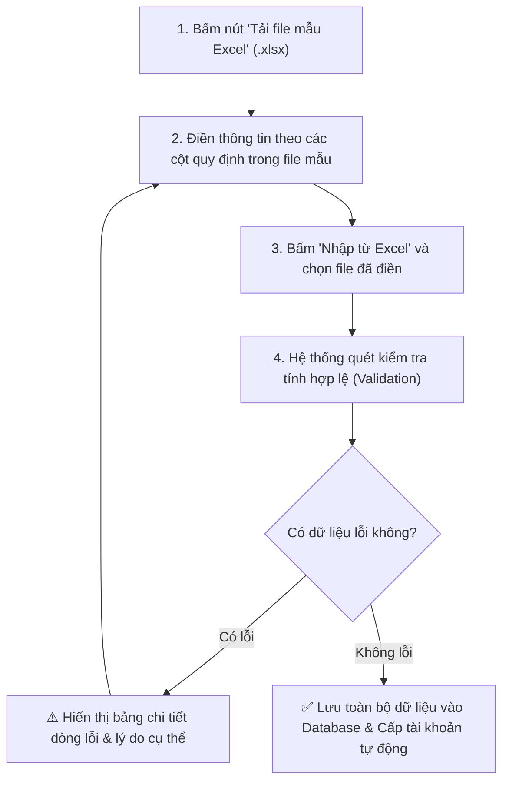

# 02. HƯỚNG DẪN QUẢN LÝ DỮ LIỆU ĐÀO TẠO & NHẬP XUẤT EXCEL HÀNG LOẠT

Tài liệu này hướng dẫn cán bộ Phòng Đào tạo & Khảo thí thiết lập và duy trì cơ sở dữ liệu học vụ nền tảng: Khoa/Viện, Lớp học, Môn học, Hồ sơ Giảng viên và Danh sách Sinh viên.

---

## 🏛️ 1. Quản Lý Danh Mục Khoa / Viện (`/departments`)

Khoa/Viện là đơn vị cấp cao nhất quản lý các chuyên ngành, bộ môn, giảng viên và sinh viên.

### Các thao tác chính:
1. **Thêm mới Khoa/Viện**:
   - Nhấn nút **"+ Thêm Khoa"** (Nút Primary màu xanh).
   - Điền các thông tin:
     - **Mã khoa**: Viết hoa không dấu, viết tắt chuẩn (Ví dụ: `CNTT`, `KT-QTKD`, `DTVT`). Mã này là duy nhất trong toàn hệ thống.
     - **Tên khoa**: Tên đầy đủ (Ví dụ: *Khoa Công nghệ Thông tin*).
     - **Trưởng khoa**: Họ tên hoặc chọn giảng viên phụ trách.
     - **Mô tả / Ghi chú**: Địa điểm văn phòng khoa, số điện thoại liên hệ.
   - Nhấn **"Lưu thông tin"**.
2. **Chỉnh sửa / Cập nhật**: Bấm vào icon cây bút hoặc dòng tương ứng trong bảng để mở Drawer chỉnh sửa thông tin.
3. **Xóa Khoa**: Chỉ được phép xóa nếu Khoa đó chưa có bất kỳ Lớp học, Môn học hoặc Giảng viên nào trực thuộc (để bảo toàn tính toàn vẹn dữ liệu).

---

## 👥 2. Quản Lý Lớp Học Sinh Viên (`/classes`)

Lớp sinh hoạt quản lý nhóm sinh viên theo niên khóa và chuyên ngành.

### Các thao tác chính:
* **Thông tin lớp bao gồm**:
  - **Mã lớp**: Duy nhất (Ví dụ: `CNTT-K18A`, `QTKD-K19B`).
  - **Tên lớp**: Tên hiển thị đầy đủ.
  - **Khoa trực thuộc**: Chọn từ danh mục Khoa đã tạo.
  - **Khóa học / Niên khóa**: Ví dụ: `2022 - 2026`.
* **Tra cứu & Bộ lọc**:
  - Lọc theo Khoa/Viện.
  - Tìm kiếm nhanh theo Mã lớp hoặc Tên lớp.
  - Xem danh sách sinh viên hiện diện trong từng lớp chỉ với 1 cú click.

---

## 📚 3. Quản Lý Danh Mục Môn Học (`/subjects`)

Môn học là trung tâm kết nối giữa ngân hàng đề thi, lịch thi và giảng viên phụ trách.

### Các trường dữ liệu quan trọng:
* **Mã môn học**: Mã định danh duy nhất (Ví dụ: `IT101`, `MATH201`).
* **Tên môn học**: Tên chính thức (Ví dụ: *Cơ sở dữ liệu*, *Toán giải tích 1*).
* **Số tín chỉ**: Số nguyên dương từ 1 đến 10.
* **Khoa phụ trách**: Khoa quản lý chuyên môn của môn học.
* **Hình thức thi chính**: Trắc nghiệm máy tính (`ONLINE_QUIZ`), Tự luận (`ESSAY`), hoặc Kết hợp (`HYBRID`).

---

## 👨‍🏫 4. Quản Lý Hồ Sơ Giảng Viên (`/teachers`)

Cơ sở dữ liệu cán bộ giảng dạy tham gia coi thi, ra đề và chấm thi.

### Các bước quản lý:
1. **Thêm mới hồ sơ giảng viên**:
   - Nhập **Mã giảng viên** (Ví dụ: `GV001`, `GV002`).
   - Nhập **Họ và tên**, **Email công vụ** (Email này sẽ dùng để đăng nhập hệ thống).
   - Chọn **Học hàm / Học vị**: Thạc sĩ, Tiến sĩ, Phó Giáo sư, Giáo sư...
   - Chọn **Khoa / Bộ môn công tác**.
   - Thiết lập **Mật khẩu khởi tạo** (Mặc định gợi ý: `Teacher@123`).
2. **Kích hoạt / Khóa tài khoản**:
   - Quản trị viên có thể tạm khóa tài khoản khi giảng viên nghỉ phép hoặc chuyển công tác mà không làm mất lịch sử các ca coi thi/chấm thi trước đó.

---

## 🎓 5. Quản Lý Hồ Sơ Sinh Viên (`/students`)

Quản lý thông tin thí sinh tham gia các kỳ thi chính thức.

### Dữ liệu quản lý sinh viên:
- **Mã sinh viên (MSSV)**: Mã duy nhất (Ví dụ: `20210001`).
- **Họ và tên**: Tiếng Việt có dấu chuẩn Unicode.
- **Ngày sinh**: Định dạng `DD/MM/YYYY`.
- **Giới tính**: Nam / Nữ.
- **Lớp học**: Thuộc một lớp đã khai báo trong hệ thống.
- **Email sinh viên**: Dùng nhận thông báo lịch thi và đăng nhập thi trực tuyến.

---

## 📊 6. Quy Trình Nhập / Xuất Excel Hàng Loạt (Batch Import / Export)

Nhập từng sinh viên hay giảng viên thủ công sẽ rất tốn thời gian. Hệ thống cung cấp công cụ **Import Excel chuẩn xác 100%**:

### Hướng dẫn tải mẫu và nhập dữ liệu:
1. Tại trang quản lý tương ứng (`/students` hoặc `/teachers`), nhấn nút **"Nhập từ Excel"**.
2. Nhấn vào liên kết **"Tải file mẫu chuẩn (.xlsx)"**.
3. Mở file bằng Microsoft Excel, Google Sheets hoặc LibreOffice:
   - Giữ nguyên tên các tiêu đề cột ở dòng 1.
   - Điền dữ liệu từ dòng số 2 trở đi.
   - Cột ngày tháng nhập đúng định dạng `YYYY-MM-DD` hoặc `DD/MM/YYYY`.
   - Cột Mã lớp, Mã khoa phải trùng khớp chính xác với mã đã tạo trong hệ thống.
4. Kéo thả file Excel vào ô tải lên và nhấn **"Bắt đầu tải dữ liệu"**.

### Cơ chế kiểm soát an toàn khi Import:
* **Chống trùng lặp**: Nếu phát hiện trùng MSSV hoặc Email đã tồn tại, hệ thống sẽ cảnh báo chi tiết từng dòng.
* **Giao dịch an toàn**: Toàn bộ sinh viên trong file được tạo kèm tài khoản đăng nhập và phân vai trò `STUDENT` ngay lập tức.
* **Xuất Excel (Export)**: Nhấn nút **"Xuất Excel"** để tải toàn bộ danh sách sinh viên/giảng viên hiện có ra file `.xlsx` định dạng đẹp mắt, có tiêu đề trường, thời gian xuất và đóng băng thanh tiêu đề cột.
