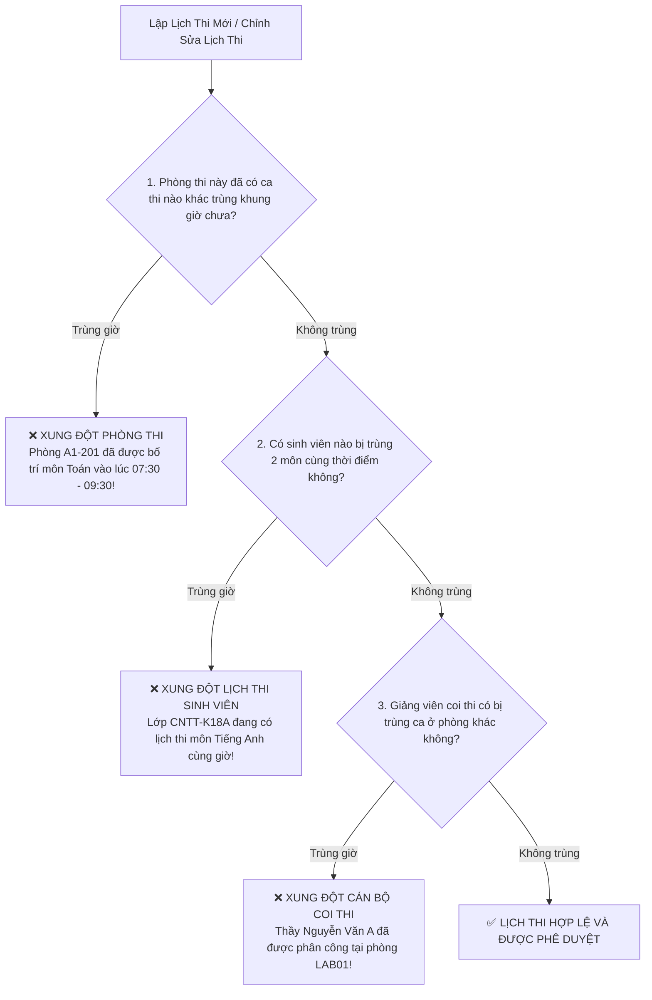

# 03. HƯỚNG DẪN TỔ CHỨC KỲ THI, QUẢN LÝ PHÒNG THI & LẬP LỊCH THI MÔN HỌC

Tài liệu này hướng dẫn cán bộ Phòng Khảo thí thực hiện các nghiệp vụ then chốt: Thiết lập Đợt thi (Kỳ thi học kỳ), Khai báo Danh mục Phòng thi và Lập Lịch thi môn học có hỗ trợ động cơ tự động phát hiện và ngăn chặn trùng lịch thi.

---

## 🗓️ 1. Quản Lý Đợt Thi / Kỳ Thi Học Kỳ (`/exam-periods`)

Đợt thi (Kỳ thi) là đơn vị gom nhóm thời gian cao nhất để tổ chức các môn thi trong một giai đoạn đào tạo (Ví dụ: *Thi kết thúc học phần Học kỳ 1 Năm học 2025 - 2026* hoặc *Thi phụ Đợt 2*).

### Các trường dữ liệu khởi tạo kỳ thi:
* **Mã kỳ thi**: Viết tắt không dấu (Ví dụ: `HK1_2025_2026`, `SUMMER_2025`).
* **Tên kỳ thi**: Tên hiển thị trang trọng (Ví dụ: *Kỳ thi kết thúc học phần Học kỳ 1 - Năm học 2025–2026*).
* **Năm học**: Ví dụ: `2025-2026`.
* **Học kỳ**: Chọn `Học kỳ 1`, `Học kỳ 2`, hoặc `Học kỳ hè`.
* **Khoảng thời gian**:
  - **Ngày bắt đầu**: Ngày đầu tiên diễn ra kỳ thi.
  - **Ngày kết thúc**: Ngày kết thúc toàn bộ các ca thi.
* **Trạng thái kỳ thi**:
  - ⚪ `DRAFT` (Nháp): Đang lên kế hoạch, chưa công bố cho sinh viên.
  - 🔵 `ACTIVE` (Đang diễn ra): Kỳ thi đang được tổ chức và diễn ra thực tế.
  - 🟢 `COMPLETED` (Hoàn thành): Đã kết thúc toàn bộ ca thi và hoàn tất chấm thi.
  - 🔒 `LOCKED` (Khóa kỳ thi): Đóng toàn bộ dữ liệu, không cho phép chỉnh sửa điểm số hoặc lịch thi trừ khi có phê duyệt đặc biệt của Hội đồng thi.

---

## 🏢 2. Quản Lý Danh Mục Phòng Thi (`/exam-rooms`)

Cung cấp danh mục các phòng học, giảng đường hoặc phòng máy tính thực tế của trường dùng để tổ chức thi.

### Các thông số của một phòng thi:
* **Mã phòng**: Mã nhận diện gắn trên cửa phòng (Ví dụ: `A1-201`, `B2-LAB03`).
* **Tên phòng**: Ví dụ: *Phòng Máy tính 03 - Tòa nhà B2*.
* **Cơ sở / Khu vực**: Khu A, Khu B, Cơ sở 1, Cơ sở 2...
* **Sức chứa tối đa (Capacity)**: Số chỗ ngồi hoặc số máy tính hoạt động tốt (Ví dụ: `40`, `60`, `120` thí sinh).
* **Loại phòng thi**:
  - `THEORY_ROOM`: Phòng thi lý thuyết / thi viết tự luận trên giấy.
  - `COMPUTER_LAB`: Phòng máy tính thi trắc nghiệm trực tuyến hoặc thi thực hành lập trình.
* **Trạng thái phòng**:
  - `READY`: Sẵn sàng sử dụng.
  - `MAINTENANCE`: Đang sửa chữa máy tính, bàn ghế (hệ thống sẽ loại trừ phòng này khỏi thuật toán xếp phòng tự động).

---

## 📅 3. Lập Lịch Thi Môn Học (`/exam-schedules`)

Lập lịch thi là việc xác định môn học nào sẽ thi vào ngày nào, từ mấy giờ đến mấy giờ và hình thức thi là gì.

### Các bước tạo lịch thi môn học:
1. Nhấn nút **"+ Tạo Lịch thi"**.
2. Chọn **Kỳ thi áp dụng** (Ví dụ: *Học kỳ 1 - 2025–2026*).
3. Chọn **Môn học** cần tổ chức thi từ danh sách môn học.
4. Chọn **Ngày thi**: Phải nằm trong khoảng thời gian diễn ra của Kỳ thi đã chọn.
5. Chọn **Khung giờ / Ca thi**:
   - Nhập **Giờ bắt đầu** (Ví dụ: `07:30`) và **Giờ kết thúc** (Ví dụ: `09:30`).
   - Thời lượng làm bài tự động tính (Ví dụ: `60 phút`, `90 phút` hoặc `120 phút`).
6. Chọn **Hình thức thi**:
   - `ONLINE_QUIZ`: Thi trắc nghiệm trên máy tính.
   - `ESSAY`: Thi tự luận viết hoặc nộp file.
   - `HYBRID`: Kết hợp trắc nghiệm khách quan và câu hỏi tự luận.
7. Nhấn **"Lưu lịch thi"**.

---

## 🛡️ 4. Động Cơ Tự Động Kiểm Tra & Chống Trùng Lịch Thi (Conflict Prevention Engine)

Để đảm bảo tính nghiêm túc và khả thi tuyệt đối, hệ thống kích hoạt **3 Bộ lọc Kiểm tra Xung đột thời gian thực**:

### Các quy tắc nghiệp vụ bắt buộc:
1. **Phòng thi duy nhất**: Một phòng thi vật lý tại một thời điểm nhất định chỉ được phép phục vụ duy nhất 1 ca thi.
2. **Thí sinh không thể phân thân**: Một sinh viên không bao giờ được xếp lịch thi 2 môn học trong cùng một buổi thi hoặc có khoảng thời gian làm bài giao nhau.
3. **Giám thị độc lập**: Giảng viên không thể cùng lúc coi thi ở 2 phòng khác nhau.
4. **Không vượt sức chứa**: Tổng số thí sinh xếp vào phòng thi không được lớn hơn `Sức chứa tối đa` của phòng đó.

> [!IMPORTANT]
> Khi hệ thống phát hiện bất kỳ xung đột nào, form lưu lịch sẽ hiển thị cảnh báo đỏ nổi bật, chỉ rõ phòng nào, môn nào hoặc nhóm sinh viên nào đang bị trùng kèm đường dẫn để cán bộ khảo thí điều chỉnh khung giờ ngay lập tức.
