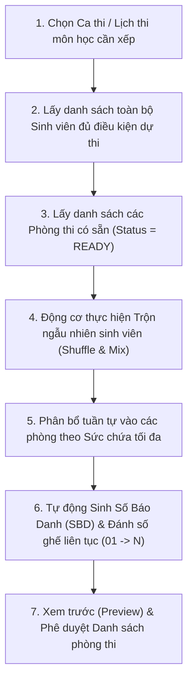

# 04. HƯỚNG DẪN XẾP PHÒNG THI, SINH SỐ BÁO DANH & PHÂN CÔNG GIÁM THỊ TỰ ĐỘNG

Tài liệu này hướng dẫn cán bộ Phòng Khảo thí vận hành phân hệ **Xếp phòng thi thông minh (`/exam-arrangement`)** và **Phân công cán bộ coi thi (`/exam-supervisors`)** nhằm đảm bảo tính bảo mật, ngẫu nhiên và khách quan trong kỳ thi.

---

## 🎲 1. Thuật Toán Xếp Phòng Thi Tự Động (`/exam-arrangement`)

Sau khi đã lập lịch thi môn học, hệ thống sẽ thực hiện phân bổ sinh viên vào các phòng thi trống dựa trên thuật toán tối ưu hóa sức chứa:

### Các bước vận hành:
1. Truy cập menu **"Khảo thí & Tổ chức thi" ➔ "Xếp phòng thi"** (`/exam-arrangement`).
2. Chọn **Kỳ thi** và **Lịch thi môn học** cần xử lý.
3. Nhấp nút **"Khởi chạy Xếp phòng tự động"**.
4. Cấu hình các tham số phân bổ:
   - **Quy tắc Trộn sinh viên**: Bật tùy chọn *Trộn sinh viên giữa các lớp khác nhau* để sinh viên cùng lớp không ngồi kế tiếp nhau, hạn chế tối đa việc trao đổi bài.
   - **Tỷ lệ giãn cách chỗ ngồi**: Mặc định 100% sức chứa, hoặc giảm xuống 80% nếu phòng thi máy tính cần chừa khoảng cách 1 máy trống.
5. Nhấn **"Bắt đầu thuật toán"**. Quá trình xử lý thường chỉ mất 1–3 giây cho danh sách hàng trăm sinh viên.

---

## 🔢 2. Cơ Chế Sinh Số Báo Danh (SBD) & Gán Số Ghế Ngồi

### Quy tắc đánh mã Số Báo Danh:
* **Công thức chuẩn**: `[Mã Tiền Tố Kỳ Thi] - [Mã Ca Thi] - [Số Thứ Tự 4 Chữ Số]`
  - Ví dụ: Thí sinh thứ 45 trong ca thi môn Cơ sở dữ liệu kỳ HK1 sẽ có SBD: `KT1-CSDL-0045`.
  - Đảm bảo tính duy nhất tuyệt đối trong toàn bộ kỳ thi, không bao giờ trùng lặp.
* **Gán số ghế ngồi**:
  - Số ghế được đánh số liên tục từ `01`, `02`, `03`... đến hết sức chứa phòng thi.
  - Sơ đồ chỗ ngồi tương ứng với vị trí thực tế của phòng học/phòng máy để giám thị dễ dàng kiểm tra danh tính.

### Xem trước & Tinh chỉnh thủ công:
* Cán bộ khảo thí có thể xem danh sách phân phòng chi tiết:
  - Tên phòng thi (Ví dụ: `Phòng 101 - Sĩ số: 40 thí sinh`).
  - Danh sách sinh viên trong phòng, SBD, Số ghế, Lớp sinh hoạt.
* Nếu có trường hợp sinh viên đặc biệt (khuyết tật, cần hỗ trợ y tế), cán bộ có thể click vào thí sinh để chuyển đổi phòng thi hoặc đổi số ghế thủ công trước khi bấm **"Chốt danh sách phòng thi"**.

---

## 👨‍🏫 3. Phân Công Cán Bộ Coi Thi (`/exam-supervisors`)

Mỗi phòng thi chính thức bắt buộc phải có tối thiểu 2 cán bộ coi thi độc lập:
- **Giám thị 1 (Coi thi chính)**: Chịu trách nhiệm nhận đề, gọi tên thí sinh vào phòng, điểm danh, mở ca thi trực tuyến và ký biên bản nộp bài.
- **Giám thị 2 (Coi thi phụ)**: Chịu trách nhiệm giám sát trật tự chung, hỗ trợ giám sát thí sinh, kiểm tra căn cước công dân/thẻ sinh viên.

### Các bước phân công giám thị:
1. Truy cập menu **"Phân công coi thi"** (`/exam-supervisors`).
2. Lọc theo Kỳ thi hoặc Ca thi cần phân công.
3. Tại mỗi phòng thi trong danh sách:
   - Chọn **Giám thị 1** từ danh bạ giảng viên.
   - Chọn **Giám thị 2** từ danh bạ giảng viên.
4. Nhấn **"Lưu phân công"**.

### Thuật toán Ràng buộc An toàn trong Phân công:
* **Chống trùng ca**: Hệ thống sẽ tự động lọc bỏ các giảng viên đã được bố trí ở phòng thi khác trong cùng khung giờ.
* **Quy chế sư phạm**: Không phân công giảng viên coi thi đúng môn học mà giảng viên đó đang trực tiếp đứng lớp giảng dạy (nếu nhà trường bật quy tắc này trong cấu hình hệ thống).
* **Cân bằng tải coi thi**: Hệ thống hiển thị số lượng ca thi mà mỗi giảng viên đã được giao để đảm bảo phân bổ khối lượng công việc đồng đều, công bằng.

---

## 🖨️ 4. Xuất Biên Bản & Danh Sách Phòng Thi

Sau khi hoàn tất xếp phòng và phân công giám thị:
1. Bấm nút **"Xuất danh sách phòng thi"** để tải file Excel/PDF.
2. In ấn các tài liệu phục vụ ngày thi:
   - **Danh sách dán cửa phòng thi**: Chứa SBD, Họ tên, Lớp, Số ghế để thí sinh đối chiếu trước khi vào phòng.
   - **Bảng ký tên nộp bài thi**: Để thí sinh ký xác nhận khi nộp bài thi giấy hoặc nộp bài trực tuyến.
   - **Biên bản bàn giao ca thi**: Dành cho Giám thị 1 và Giám thị 2 ký xác nhận sĩ số có mặt, vắng mặt và các trường hợp bất thường.
