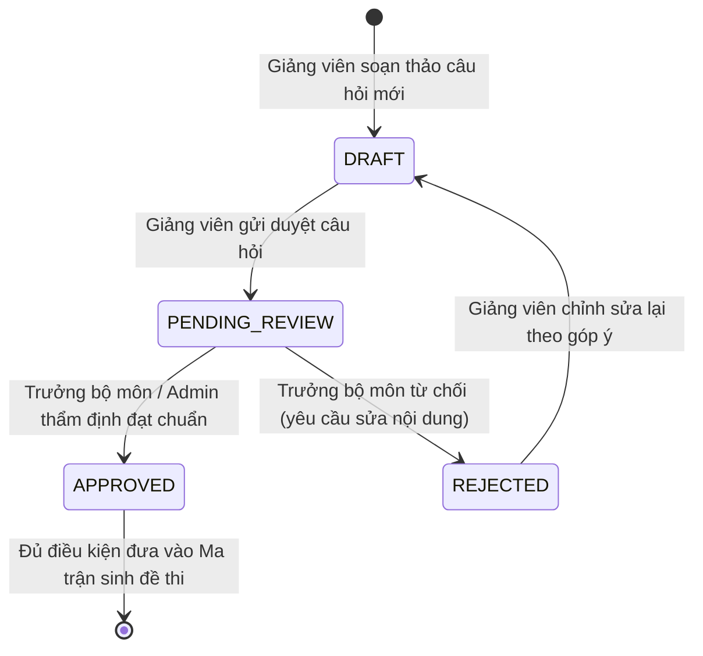

# 05. HƯỚNG DẪN QUẢN LÝ NGÂN HÀNG CÂU HỎI & TẠO ĐỀ THI MA TRẬN TỰ ĐỘNG

Tài liệu này hướng dẫn cán bộ Khảo thí và Trưởng bộ môn khai thác phân hệ **Ngân hàng Câu hỏi (`/question-bank`)** và **Động cơ Sinh Đề thi Ma trận Động (`/exam-papers`)**.

---

## 📚 1. Quản Lý Ngân Hàng Câu Hỏi (`/question-bank`)

Ngân hàng câu hỏi là kho dữ liệu tri thức của từng môn học, phục vụ việc tạo đề thi kiểm tra định kỳ và thi kết thúc học phần.

### A. Phân loại câu hỏi theo Cấp độ Nhận thức (Bloom's Taxonomy):
* **Dễ (Nhận biết - EASY)**: Câu hỏi kiểm tra ghi nhớ định nghĩa, khái niệm cơ bản.
* **Trung bình (Thông hiểu - MEDIUM)**: Yêu cầu hiểu bản chất, giải thích hiện tượng hoặc làm bài toán mẫu.
* **Khó (Vận dụng - HARD)**: Áp dụng lý thuyết vào tình huống mới, phân tích và tính toán phức tạp.
* **Rất khó (Vận dụng cao - VERY_HARD)**: Tổng hợp, đánh giá và giải quyết bài toán thực tế nâng cao.

### B. Các hình thức câu hỏi được hỗ trợ:
1. **Trắc nghiệm đơn lựa chọn (Single Choice)**: Có 4 phương án (A, B, C, D), chỉ duy nhất 1 đáp án đúng.
2. **Trắc nghiệm nhiều lựa chọn (Multiple Choice)**: Cho phép chọn nhiều đáp án đúng, thí sinh được tính điểm theo tỷ lệ câu đúng.
3. **Đúng / Sai (True / False)**: Thí sinh xác nhận mệnh đề là Đúng hoặc Sai.
4. **Câu hỏi Tự luận (Essay)**: Thí sinh nhập bài làm dạng văn bản hoặc nộp đính kèm file; giảng viên chấm bài theo khung tiêu chí Rubric.

---

## 🔒 2. Quy Trình Soạn Thảo & Phê Duyệt Câu Hỏi (Approval Workflow)

Để bảo đảm chất lượng học thuật và tính chính xác của đề thi, câu hỏi phải trải qua quy trình kiểm duyệt 3 bước:

> [!IMPORTANT]
> **Quy tắc Nghiệp vụ Bắt buộc**: Thuật toán sinh đề thi chỉ được phép bốc các câu hỏi có trạng thái **`APPROVED` (Đã duyệt)**. Tuyệt đối không đưa các câu hỏi đang là Bản nháp (`DRAFT`) hoặc Đang chờ duyệt (`PENDING_REVIEW`) vào đề thi chính thức.

---

## ⚙️ 3. Thiết Lập Ma Trận Đề Thi & Sinh Đề Tự Động (`/exam-papers`)

Ma trận đề thi quy định cấu trúc phân bổ câu hỏi nhằm đảm bảo mọi đề thi sinh ra đều tương đồng về độ khó và chuẩn đầu ra môn học.

### A. Cấu hình Ma trận Đề thi (Exam Matrix):
Tại màn hình tạo đề thi mới:
1. Chọn **Môn học** và nhập **Tên đề thi** (Ví dụ: *Đề thi Cuối kỳ Cơ sở dữ liệu - HK1*).
2. Thiết lập **Tổng số câu hỏi** (Ví dụ: `40 câu`) và **Thời lượng làm bài** (Ví dụ: `60 phút`).
3. Khai báo tỷ lệ độ khó mong muốn:
   - Số câu Dễ: `16 câu` (40%).
   - Số câu Trung bình: `16 câu` (40%).
   - Số câu Khó: `8 câu` (20%).
4. Phân bổ theo Chương / Chủ đề bài học:
   - Chương 1 (Mô hình ER): 10 câu.
   - Chương 2 (Đại số quan hệ & Chuẩn hóa): 15 câu.
   - Chương 3 (Ngôn ngữ SQL): 15 câu.
5. Nhập số lượng **Mã đề cần sinh** (Ví dụ: `4 mã đề`: `101`, `102`, `103`, `104`).

### B. Cơ chế Xáo trộn Đề thi (Randomization & Shuffling):
Khi nhấn nút **"Khởi chạy Sinh Đề Thi"**, hệ thống sẽ thực hiện:
* **Trộn ngẫu nhiên câu hỏi (Question Shuffling)**: Các đề thi có cùng cấu trúc ma trận nhưng thứ tự xuất hiện các câu hỏi khác nhau hoàn toàn.
* **Trộn phương án trả lời (Option Shuffling)**: Vị trí của đáp án đúng A, B, C, D được hoán vị ngẫu nhiên giữa các mã đề, triệt tiêu khả năng thí sinh nhìn bài nhau.

---

## 📸 4. Cơ Chế Lưu Vết Snapshot Đề Thi Phát Hành

Hệ thống áp dụng cơ chế **Question Snapshot Architecture**:
* Tại khoảnh khắc Đề thi được duyệt và công bố, toàn bộ nội dung câu hỏi, hình ảnh đính kèm, phương án lựa chọn và đáp án đúng sẽ được "đóng băng" (Snapshot) thành một bản lưu trữ bất biến.
* **Lợi ích an toàn**: Dù sau này giảng viên có chỉnh sửa nội dung câu hỏi gốc trong Ngân hàng câu hỏi, thì bài làm và kết quả thi của sinh viên đã làm đề thi đó trong quá khứ vẫn giữ nguyên tính chính xác lịch sử 100%, phục vụ việc thanh tra, kiểm định chất lượng giáo dục.

---

## 🔑 5. Đặt Mật Khẩu Đề Thi Ca Thi (Exam Password Security)

Để bảo đảm tính bí mật tuyệt đối của đề thi trước giờ G:
1. Mỗi đề thi chính thức được bảo vệ bằng một **Mã bảo mật / Mật khẩu đề thi** (Ví dụ: `CSDL@2026`).
2. Mật khẩu này được mã hóa một chiều trong CSDL.
3. Khi sinh viên đăng nhập vào màn hình phòng thi trực tuyến, sinh viên sẽ thấy đề thi ở trạng thái **"Khóa - Đang chờ mở ca"**.
4. Đúng giờ làm bài (ví dụ: `07:30`), Giám thị 1 công bố mật khẩu trên bảng lớp hoặc gửi thông báo trực tuyến trong phòng thi ảo. Sinh viên nhập đúng mật khẩu mới có thể mở đề và bắt đầu tính giờ làm bài.
