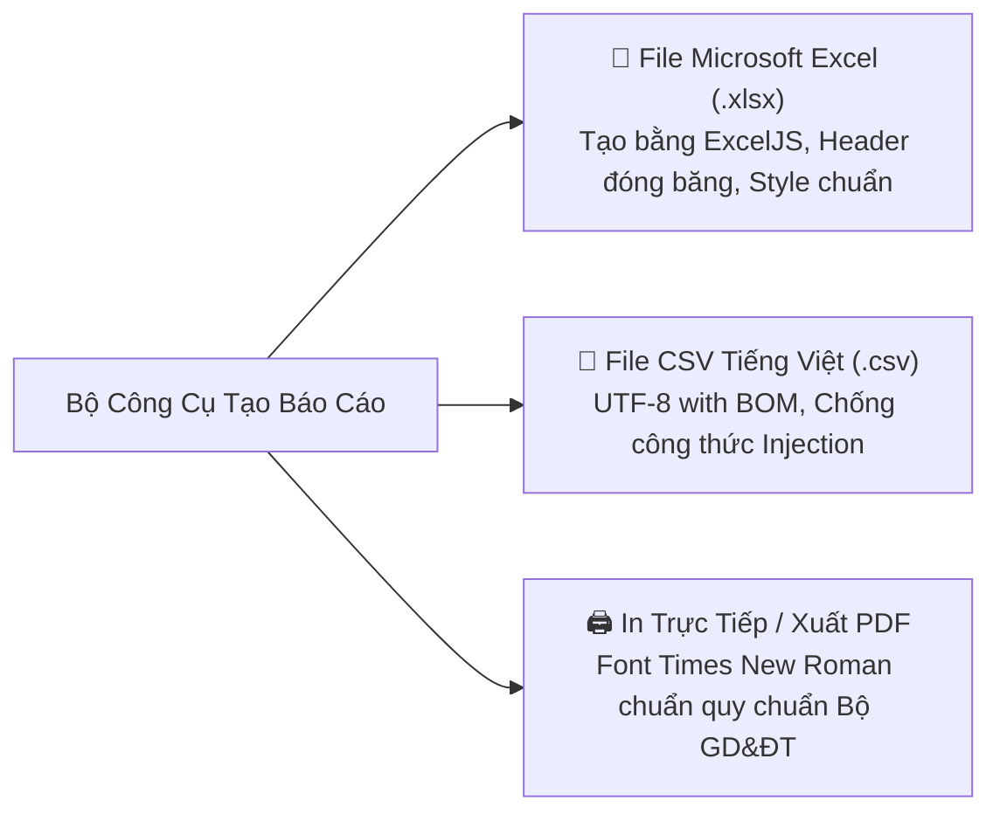

# 06. HƯỚNG DẪN KHAI THÁC TRUNG TÂM TỔNG BÁO CÁO & XUẤT DỮ LIỆU KHẢO THÍ

Tài liệu này hướng dẫn cán bộ Khảo thí và Lãnh đạo Đào tạo sử dụng **Trung tâm Tổng báo cáo Khảo thí (`/exam-reports`)** để theo dõi số liệu tổng quan, phân tích phổ điểm và xuất dữ liệu báo cáo chính thức đạt chuẩn quy cách hành chính.

---

## 📊 1. Tổng Quan Không Gian Báo Cáo (`/exam-reports`)

Trang `/exam-reports?view=summary` là đầu mối tổng hợp số liệu khảo thí duy nhất của nhà trường. Hệ thống áp dụng nguyên tắc **Dữ liệu Chính thức Bất khả xâm phạm (`mode = OFFICIAL`)**: Tuyệt đối không trộn lẫn số liệu thi thử hoặc luyện tập tự do của sinh viên vào các báo cáo chính thức này.

Giao diện làm việc được chia thành 3 khu vực:
1. **Bảng Tổng Quan (Overview & KPIs)**: Hiển thị các chỉ số đo lường hiệu suất chính theo thời gian thực (Số ca thi đã hoàn thành, Tỷ lệ sinh viên có mặt, Điểm trung bình toàn trường, Tỷ lệ bài thi đã hoàn tất chấm).
2. **Bộ Công Cụ Tạo Báo Cáo (Report Generator)**: Nơi người dùng lựa chọn mẫu biểu, tùy biến bộ lọc, chọn cột dữ liệu hiển thị, xem trước bản in (Preview) và xuất file.
3. **Nhật Ký Xuất File (Export History)**: Lưu giữ 30 phiên xuất file gần nhất trên trình duyệt và tự động ghi vết vào Audit Log của máy chủ backend.

---

## 📑 2. Danh Mục 7 Mẫu Báo Cáo Khảo Thí Chuẩn Hóa

Hệ thống cung cấp danh mục biểu mẫu động từ API `GET /exam-reports/catalog`:

| STT | Tên Mẫu Báo Cáo | Mục đích sử dụng & Ý nghĩa số liệu |
| :---: | :--- | :--- |
| **1** | **Tổng Hợp Toàn Kỳ Thi** | Báo cáo toàn diện cho Ban Giám hiệu: Tổng số môn thi, tổng số lượt thí sinh đăng ký, tỷ lệ vắng thi, tỷ lệ hoàn thành chấm thi toàn trường. |
| **2** | **Kết Quả Chi Tiết Theo Ca Thi** | Bảng điểm chi tiết của từng sinh viên trong một ca thi cụ thể: SBD, Họ tên, Lớp, Điểm trắc nghiệm, Điểm tự luận, Tổng điểm kết luận. |
| **3** | **Phân Tích Phổ Điểm (Grade Distribution)** | Thống kê số lượng và tỷ lệ % sinh viên đạt theo từng thang điểm (Dưới 4.0: Yếu kém, 4.0 - 5.4: Trung bình, 5.5 - 6.9: Khá, 7.0 - 8.4: Giỏi, 8.5 - 10.0: Xuất sắc). Kèm biểu đồ trực quan hình chuông chuẩn Gauss. |
| **4** | **Tình Hình Dự Thi & Vắng Thi** | Danh sách sinh viên vắng thi có lý do (hoãn thi) và vắng thi không lý do (nhận điểm 0), phục vụ xét tư cách học vụ. |
| **5** | **Tiến Độ Chấm Thi Tự Luận** | Theo dõi khối lượng bài tự luận đã chấm và chưa chấm của từng giảng viên; cảnh báo các túi bài sắp trễ hạn công bố điểm. |
| **6** | **Tổng Hợp Cảnh Báo & Xử Lý Vi Phạm** | Ghi nhận danh sách thí sinh bị lập biên bản kỷ luật phòng thi (Khiển trách: trừ 25% điểm; Cảnh cáo: trừ 50% điểm; Đình chỉ thi: điểm 0 và hủy kết quả). |
| **7** | **Báo Cáo Tiếp Nhận & Xử Lý Phúc Khảo** | Tổng hợp số lượng đơn khiếu nại điểm thi, kết quả chấm thẩm định lại (Tăng điểm, Giữ nguyên, Hạ điểm) và biên bản kết luận. |

---

## 🔍 3. Bộ Lọc Dữ Liệu Dùng Chung & Cơ Chế Xem Trước (Preview)

Để trích xuất đúng thông tin mong muốn, người dùng kết hợp linh hoạt các bộ lọc:
* **Kỳ thi (Exam Period)**: Chọn đợt thi cần thống kê.
* **Khoa / Viện**: Lọc theo đơn vị quản lý chuyên môn.
* **Môn học**: Chọn môn học cụ thể.
* **Lớp sinh hoạt**: Xem báo cáo riêng theo từng lớp sinh viên.
* **Khung thời gian**: Từ ngày... Đến ngày...

### Quy trình Xem trước (Preview):
1. Sau khi chọn bộ lọc, nhấn nút **"Xem trước dữ liệu"** (Preview).
2. Hệ thống gọi API `POST /exam-reports/preview` và tải tối đa 50 bản ghi đầu tiên lên bảng hiển thị.
3. Người dùng có thể bật/tắt các cột thông tin cần xuất thông qua dropdown **"Tùy chọn cột hiển thị"** (Column Toggle).
4. Kiểm tra kỹ số liệu mẫu trước khi ra lệnh xuất file chính thức.

---

## 📥 4. Các Định Dạng Xuất File & Tiêu Chuẩn Kỹ Thuật

Hệ thống hỗ trợ 3 định dạng xuất dữ liệu:

### Tiêu chuẩn kỹ thuật chi tiết:
1. **Định dạng Microsoft Excel (`.xlsx`)**:
   - Sử dụng thư viện `ExcelJS` phía máy chủ để tạo file Excel nguyên bản, không phải file HTML giả mạo.
   - Có tiêu đề trường trang trọng (Tên trường, Tên khoa, Tiêu đề bảng điểm, Ngày in).
   - Tự động đóng băng dòng tiêu đề (Freeze Header Row) giúp cuộn trang dễ dàng.
   - Các cột số điểm được căn phải và định dạng 1 chữ số thập phân (`tabular-nums`).
2. **Định dạng CSV (`.csv`)**:
   - Chèn tiền tố **UTF-8 BOM** (`0xEF, 0xBB, 0xBF`) ở đầu file để phần mềm Excel trên hệ điều hành Windows mở file trực tiếp mà không bị lỗi bảng mã tiếng Việt.
   - **Chống tấn công CSV Formula Injection**: Mọi chuỗi ký tự bắt đầu bằng các ký tự nguy hiểm như `=`, `+`, `-`, `@` đều được tự động chèn thêm dấu nháy đơn (`'`) ở đầu để vô hiệu hóa mã độc Macro.
3. **Bản in Trực tiếp / Xuất PDF**:
   - Tự động ẩn các nút điều hướng của thanh công cụ website.
   - Căn lề chuẩn trang A4 ngang/dọc, áp dụng font chữ hành chính chuẩn mực (*Times New Roman*), có phần ký tên của Người lập biểu, Trưởng phòng Khảo thí và Ban Giám hiệu.

---

## 🔐 5. Phân Quyền & Bảo Mật Dữ Liệu Báo Cáo

* **`EXAM_REPORT_VIEW`**: Quyền chỉ xem tổng quan và xem trước báo cáo.
* **`EXAM_REPORT_EXPORT`**: Quyền trích xuất file vật lý (CSV/XLSX/PDF) ra khỏi hệ thống. Đây là quyền hạn đặc biệt nhạy cảm, chỉ cấp cho Trưởng phòng Khảo thí hoặc Quản trị viên cấp cao.
* **Giới hạn phạm vi theo tài khoản**:
  - `ADMIN`: Xem và xuất toàn bộ dữ liệu của toàn trường.
  - `TEACHER`: Nếu được cấp quyền xem báo cáo, giảng viên chỉ được xem và xuất báo cáo của những ca thi hoặc phòng thi mà mình được phân công coi thi/chấm thi.
* **Nhật ký Audit Log bắt buộc**: Mỗi lần nhấn nút xuất file, hệ thống sẽ tự động lưu lại danh tính người xuất, thời gian, loại báo cáo, phạm vi bộ lọc và tổng số dòng dữ liệu đã tải về máy tính.
