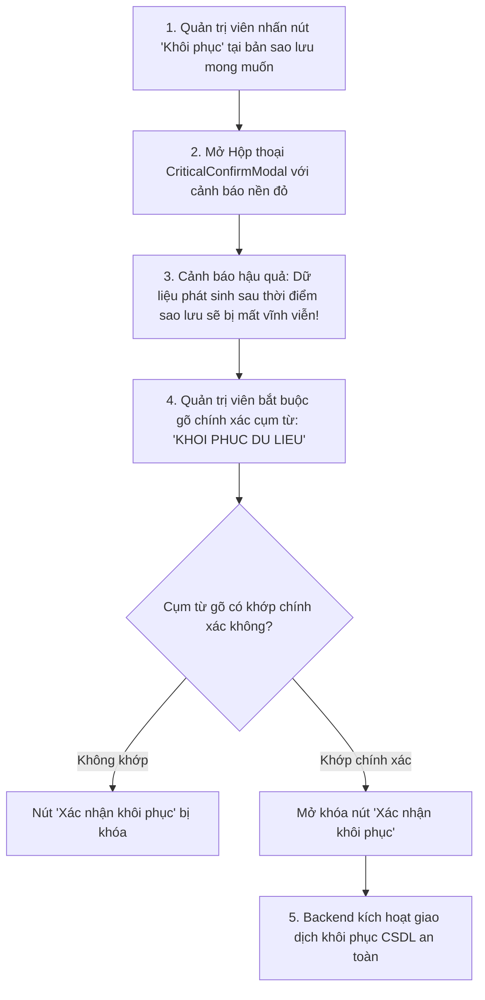

# 07. HƯỚNG DẪN QUẢN TRỊ SAO LƯU DỮ LIỆU, NHẬT KÝ HỆ THỐNG & THÙNG RÁC

Tài liệu này hướng dẫn Quản trị viên cấp cao vận hành các công cụ bảo vệ dữ liệu sống còn của nhà trường: Quản lý Bản sao lưu CSDL (`/admin/backups`), Giám sát Nhật ký Hoạt động (`/admin/activity-logs`) và Khôi phục dữ liệu từ Thùng rác (`/trash`).

---

## 💾 1. Quản Trị Sao Lưu Dữ Liệu Cơ Sở Dữ Liệu (`/admin/backups`)

Dữ liệu khảo thí (điểm thi, đề thi, lịch sử nộp bài) là tài sản vô giá của trường học. Hệ thống trang bị phân hệ quản lý sao lưu tự động và thủ công toàn diện.

### A. Hai hình thức tạo bản sao lưu:
1. **Sao lưu Tự động Chạy nền (Background Scheduled Backup)**:
   - Worker chạy ngầm theo lịch định kỳ (Mặc định: 02:00 sáng mỗi ngày hoặc 30 phút trước khi bắt đầu một ca thi lớn).
   - Tự động nén và dọn dẹp các bản sao lưu cũ theo chính sách lưu trữ (Retention Policy) để tiết kiệm dung lượng ổ cứng.
2. **Sao lưu Thủ công Tức thời (Manual On-Demand Backup)**:
   - Được khuyến nghị thực hiện trước khi tiến hành nâng cấp hệ thống, trước khi import hàng loạt dữ liệu sinh viên hoặc trước khi công bố bảng điểm chính thức.
   - **Cách thực hiện**:
     - Bấm nút **"+ Tạo bản sao lưu mới"**.
     - Nhập **Ghi chú mô tả** (Ví dụ: *Sao lưu trước khi chốt điểm thi HK1 - 2025*).
     - Chọn loại sao lưu: `FULL` (Toàn bộ dữ liệu và cấu trúc bảng).
     - Nhấn **"Bắt đầu sao lưu"**. Hệ thống sẽ trích xuất file `.sql` nén và lưu trữ vào thư mục an toàn.

### B. Tải file sao lưu về lưu trữ an toàn (Cold Storage):
* Trong bảng danh sách các bản sao lưu, Quản trị viên nhấn nút **"Tải về"** để lưu file backup vào ổ cứng ngoài hoặc máy chủ lưu trữ chuyên dụng của Trung tâm CNTT nhà trường.

### C. Quy trình Khôi phục Dữ liệu Cực kỳ Nhạy cảm (Database Restore):
Khôi phục dữ liệu sẽ ghi đè toàn bộ trạng thái database hiện tại về thời điểm tạo bản sao lưu. Do đó, hệ thống áp dụng **Hộp thoại Xác thực Đa tầng (`CriticalConfirmModal`)**:

---

## 🕵️ 2. Giám Sát Nhật Ký Hoạt Động Hệ Thống (`/admin/activity-logs`)

Mọi hành động diễn ra trong hệ thống đều được ghi vết bất biến (Immutable Audit Log) phục vụ công tác thanh tra, bảo mật và truy vết sự cố.

### Các thông tin được ghi nhận trong mỗi bản ghi log:
* **Dấu thời gian (Timestamp)**: Ngày, giờ, phút, giây chính xác đến mili-giây.
* **Tác nhân (Actor)**: Họ tên, Email, Mã định danh và Vai trò của người thực hiện hành động.
* **Địa chỉ IP & Trình duyệt (Client Info)**: Địa chỉ IP truy cập và thông tin User-Agent.
* **Hành động (Action)**: Thao tác thực hiện (Ví dụ: `LOGIN`, `UPDATE_GRADE`, `CREATE_SCHEDULE`, `EXPORT_REPORT`, `RESTORE_BACKUP`).
* **Mô-đun liên quan**: Tên bảng hoặc chức năng bị tác động.
* **Kết quả**: `SUCCESS` (Thành công) hoặc `FAILED` (Thất bại / Bị chặn quyền).

### Công cụ Metadata Inspector Drawer:
Khi cần điều tra sâu một sự cố (ví dụ: điểm thi của một sinh viên bị sửa đổi bất thường):
1. Click vào dòng log tương ứng trong bảng `/admin/activity-logs`.
2. Khay trượt bên phải (**Metadata Inspector Drawer**) sẽ mở ra.
3. Quản trị viên có thể xem toàn bộ gói dữ liệu JSON chi tiết:
   - Dữ liệu trước khi sửa (`Old State`).
   - Dữ liệu sau khi sửa (`New State`).
   - Lý do giải trình mà người thực hiện đã nhập.

---

## 🗑️ 3. Quản Lý Thùng Rác Hệ Thống (`/trash`)

Để phòng ngừa trường hợp cán bộ bấm nhầm nút xóa làm mất dữ liệu quan trọng, hệ thống áp dụng cơ chế **Xóa mềm (Soft Delete)**:

### A. Cơ chế hoạt động của Xóa mềm:
* Khi bấm nút "Xóa" một Môn học, Phòng thi, Lớp học, Câu hỏi hay Giảng viên trên giao diện, dữ liệu đó **KHÔNG bị xóa mất khỏi CSDL**.
* Thay vào đó, hệ thống chỉ cập nhật trường `deletedAt` bằng thời gian hiện tại. Dữ liệu này sẽ ngay lập tức biến mất khỏi các danh sách làm việc chính để không gây nhầm lẫn.

### B. Hai thao tác trong Thùng rác (`/trash`):
1. **Khôi phục dữ liệu (Restore)**:
   - Nếu phát hiện xóa nhầm, vào trang `/trash`, tìm đối tượng tương ứng và nhấn nút **"Khôi phục"**.
   - Dữ liệu sẽ ngay lập tức xuất hiện trở lại trong danh mục làm việc với đầy đủ liên kết ban đầu.
2. **Xóa vĩnh viễn (Hard Delete)**:
   - Chỉ áp dụng khi cán bộ chắc chắn dữ liệu đó là rác hoặc dữ liệu kiểm thử thừa.
   - Thao tác này sẽ xóa sạch bản ghi khỏi CSDL và không thể hoàn tác lại được.
