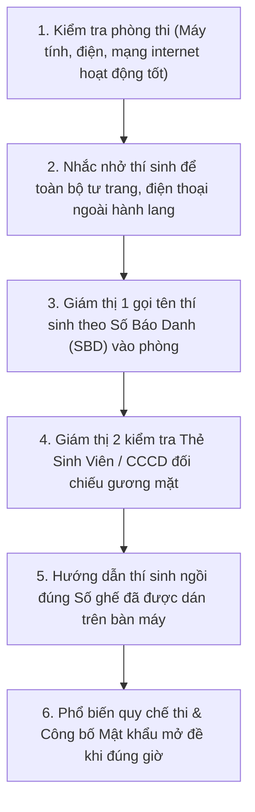

# 02. HƯỚNG DẪN TRA CỨU LỊCH COI THI & NGHIỆP VỤ PHÒNG THI ĐẦU GIỜ

Tài liệu này hướng dẫn Thầy/Cô tra cứu lịch phân công coi thi (`/teacher/assignments`) và thực hiện quy trình nghiệp vụ điểm danh, kiểm tra tư cách thí sinh trước giờ thi.

---

## 📅 1. Tra Cứu Lịch Coi Thi Của Cá Nhân (`/teacher/assignments`)

Khi Ban Khảo thí hoàn tất việc phân công cán bộ coi thi, thông tin sẽ xuất hiện ngay lập tức trên trang làm việc của Thầy/Cô.

### Thông tin hiển thị trên mỗi ca thi:
* **Môn thi**: Tên môn học và Mã môn (Ví dụ: *Cơ sở dữ liệu - IT101*).
* **Kỳ thi**: Ví dụ: *Kỳ thi kết thúc học phần Học kỳ 1 - 2025–2026*.
* **Thời gian**: Ngày thi, Giờ bắt đầu và Giờ kết thúc (Ví dụ: *07:30 – 09:30, Thứ Ba ngày 15/12/2025*).
* **Địa điểm**: Phòng thi và Tòa nhà (Ví dụ: *Phòng LAB-03, Tòa nhà B2*).
* **Vai trò trong ca**:
  - **Giám thị 1 (Chính)**: Chịu trách nhiệm chung, điều hành phòng thi và mở ca thi.
  - **Giám thị 2 (Phụ)**: Hỗ trợ giám sát trật tự, đối chiếu căn cước và giám sát hành lang.
* **Cán bộ coi thi cùng ca**: Hiển thị họ tên và số điện thoại của đồng nghiệp cùng coi thi để tiện liên hệ phối hợp.

---

## 📋 2. Tải Dữ Liệu & Chuẩn Bị Trước Giờ Thi

Thầy/Cô nên đăng nhập và tải tài liệu trước ngày thi:
1. Nhấn nút **"Xem chi tiết phòng thi"**.
2. Nhấn nút **"Tải danh sách thí sinh"** (`.pdf` hoặc `.xlsx`) để in danh sách kiểm diện.
3. Nhấn nút **"Tải bảng ký tên nộp bài"** để chuẩn bị cho thí sinh ký biên bản khi nộp bài.

> [!IMPORTANT]
> **Quy định thời gian**: Cán bộ coi thi bắt buộc phải có mặt tại Phòng Hội đồng thi hoặc trước cửa phòng thi tối thiểu **15 đến 20 phút** trước giờ bắt đầu làm bài để nhận bàn giao và thực hiện công tác chuẩn bị.

---

## 🚪 3. Quy Trình Nghiệp Vụ Đầu Giờ Tại Phòng Thi

Thầy/Cô thực hiện tuần tự 5 bước nghiệp vụ chuẩn:

### Chi tiết các lưu ý quan trọng:
1. **Kiểm tra thiết bị**: Nếu là phòng máy tính thi trực tuyến, bật máy chủ/máy trạm, kiểm tra kết nối mạng internet tới địa chỉ máy chủ thi. Nếu máy tính nào bị lỗi phần cứng, lập tức báo cán bộ kỹ thuật chuyển thí sinh sang máy dự phòng.
2. **Kiểm tra danh tính**:
   - Đối chiếu kỹ khuôn mặt thí sinh với Thẻ sinh viên hoặc Căn cước công dân (CCCD).
   - Thí sinh không có thẻ sinh viên hoặc mất giấy tờ tùy thân phải được Giám thị 1 lập biên bản cam kết và xin ý kiến của Trưởng Ban Khảo thí tại phòng Hội đồng.
3. **Tuyệt đối cấm thiết bị thu phát sóng**: Toàn bộ điện thoại thông minh, đồng hồ thông minh, tai nghe bluetooth phải tắt nguồn và để ở bàn phía đầu phòng hoặc ngoài hành lang trước khi bước vào chỗ ngồi.
4. **Công bố Mật khẩu Đề thi**: Chỉ công bố mật khẩu đề thi đúng vào thời điểm bắt đầu tính giờ làm bài (Ví dụ đúng 07:30). Không phát mật khẩu sớm để tránh việc thí sinh bắt đầu làm bài không đồng loạt.
