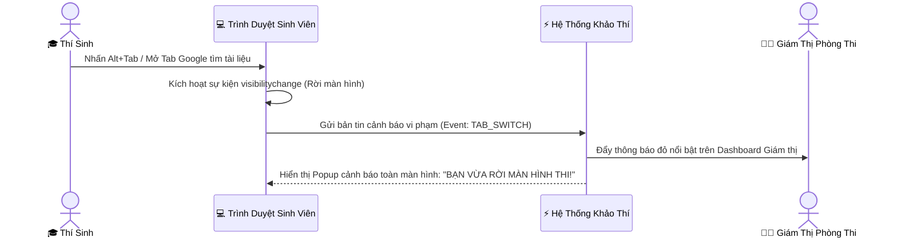

# 03. HƯỚNG DẪN GIÁM SÁT PHÒNG THI TRỰC TUYẾN THỜI GIAN THỰC (PROCTORING)

Tài liệu này hướng dẫn Giảng viên sử dụng Bảng điều khiển **Giám sát Phòng thi Trực tuyến (`/teacher/proctor`)** để theo dõi trạng thái làm bài của thí sinh, phát hiện các hành vi gian lận và thực hiện các can thiệp nghiệp vụ trong ca thi.

---

## 🖥️ 1. Giao Diện Bảng Giám Sát Phòng Thi (`/teacher/proctor`)

Khi ca thi bắt đầu, Giám thị đăng nhập vào hệ thống và chọn phòng thi đang diễn ra. Màn hình sẽ hiển thị dạng lưới (Grid) hoặc danh sách (Table) toàn bộ thí sinh trong phòng với trạng thái thời gian thực:

```
[BẢNG ĐIỀU KHIỂN PHÒNG THI: LAB-03 | MÔN: CƠ SỞ DỮ LIỆU | THỜI GIAN CÒN LẠI: 48:20]
--------------------------------------------------------------------------------------
[SBD: 001] Nguyễn Văn An   | Đang làm: Câu 24/40 | 🟢 Bình thường (0 vi phạm)
[SBD: 002] Trần Thị Bình   | Đang làm: Câu 18/40 | 🔴 CẢNH BÁO (Rời màn hình 2 lần!) [Xử lý]
[SBD: 003] Lê Hoàng Cường  | Mất kết nối 1 phút  | 🟡 Đang chờ kết nối lại...
[SBD: 004] Phạm Thu Dung   | Đã nộp bài (38/40)  | ⚪ Hoàn thành (Nộp lúc 08:15)
--------------------------------------------------------------------------------------
[Thao tác nhanh]: [📢 Gửi thông báo toàn phòng]  [⏱️ Cộng giờ]  [🔒 Khóa ca thi]
```

### Ý nghĩa 4 trạng thái thí sinh:
1. 🟢 **Đang làm bài (Active)**: Thí sinh đang tập trung trên cửa sổ thi, chuột và bàn phím tương tác bình thường.
2. 🔴 **Cảnh báo vi phạm (Violation Alert)**: Thí sinh vừa có hành vi chuyển tab trình duyệt, mở ứng dụng khác hoặc thu nhỏ cửa sổ làm bài.
3. 🟡 **Mất kết nối (Disconnected)**: Máy tính thí sinh bị rớt mạng hoặc tắt trình duyệt đột ngột (hệ thống tự động bảo lưu bài làm tại LocalStorage).
4. ⚪ **Đã nộp bài (Submitted)**: Thí sinh đã chủ động xác nhận nộp bài thi thành công.

---

## 🚨 2. Cơ Chế Tự Động Bắt Gian Lận (Anti-Cheat & Tab-Switch Detection)

Hệ thống tích hợp động cơ giám sát sự kiện trình duyệt (`Page Visibility API` & `Window Focus/Blur Event`):



### Quy tắc phân cấp xử lý vi phạm:
* **Vi phạm Lần 1**: Hệ thống hiển thị cảnh báo nhẹ trên màn hình thí sinh: *"Lần 1: Vui lòng không rời khỏi cửa sổ thi! Hành vi này đã được ghi nhận."*
* **Vi phạm Lần 2**: Bảng điều khiển của Giám thị đổi sang màu vàng cam kèm tiếng chuông cảnh báo nhẹ. Giám thị nên đi xuống trực tiếp bàn thi để nhắc nhở thí sinh.
* **Vi phạm Lần 3 trở lên**: Hệ thống đổi sang cảnh báo đỏ đậm (`CRITICAL_VIOLATION`). Giám thị tiến hành nhắc nhở lần cuối hoặc lập biên bản khiển trách/cảnh cáo theo quy chế thi.

---

## 🛠️ 3. Các Quyền Can Thiệp Ca Thi Của Giám Thị (Proctor Actions)

Trên thanh công cụ, Giám thị có đầy đủ các thẩm quyền can thiệp ca thi:

### A. Gửi thông báo toàn phòng (Broadcast Message):
- Bấm nút **"Gửi thông báo toàn phòng"**.
- Nhập nội dung (Ví dụ: *"Còn 15 phút kết thúc giờ làm bài, các em chú ý kiểm tra lại các câu chưa chọn đáp án"*).
- Thông báo sẽ lập tức hiển thị thành banner nổi bật trên đầu màn hình của tất cả thí sinh trong phòng.

### B. Cộng thêm thời gian làm bài (Add Extra Time):
- Áp dụng khi máy tính của 1 thí sinh bị sự cố phần cứng, màn hình xanh hoặc mất điện phòng thi cục bộ dẫn đến mất thời gian làm bài:
  1. Chọn thí sinh bị ảnh hưởng trong danh sách.
  2. Chọn lệnh **"Cộng giờ làm bài"**.
  3. Chọn số phút bù (Ví dụ: `+5 phút`, `+10 phút`, `+15 phút`) và nhập lý do giải trình.
  4. Đồng hồ đếm ngược trên máy thí sinh đó sẽ tự động được cộng thêm số phút tương ứng.

### C. Khóa bài tạm thời / Đình chỉ thi (Suspend / Force Submit):
- Nếu thí sinh cố tình tái diễn vi phạm gian lận hoặc gây rối trật tự phòng thi:
  1. Bấm nút **"Xử lý vi phạm"** trên dòng thí sinh.
  2. Chọn **"Đình chỉ thi & Buộc nộp bài"**.
  3. Hệ thống sẽ ngay lập tức khóa quyền làm bài của thí sinh, thu bài tại trạng thái hiện tại và chấm điểm các câu đã làm.
  4. Giám thị lập biên bản đình chỉ thi bằng văn bản giấy có chữ ký của 2 giám thị và thí sinh.

---

## 🏁 4. Nghiệp Vụ Kết Thúc Ca Thi

1. Khi đồng hồ đếm ngược của phòng thi về `00:00`, toàn bộ máy tính của thí sinh sẽ tự động khóa và nộp bài lên máy chủ.
2. Giám thị kiểm tra trên màn hình để đảm bảo 100% thí sinh đã chuyển sang trạng thái **⚪ Đã nộp bài**.
3. Cho từng thí sinh ký tên xác nhận vào **Bảng ký nộp bài**.
4. Bấm nút **"Khóa ca thi" (Close Proctoring Session)** trên giao diện giám thị để đóng quyền truy cập ca thi.
5. Ký biên bản bàn giao phòng thi và gửi về Ban Khảo thí tại phòng Hội đồng.
