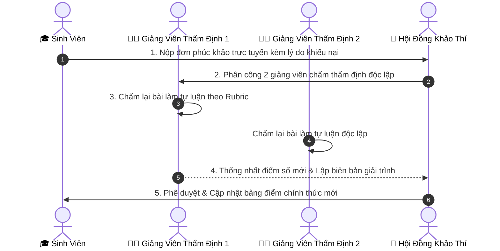

# 05. HƯỚNG DẪN TIẾP NHẬN & GIẢI QUYẾT ĐƠN PHÚC KHẢO ĐIỂM THI

Tài liệu này hướng dẫn Giảng viên và Hội đồng Chấm thi thực hiện quy trình thẩm định lại bài thi và xử lý đơn khiếu nại điểm số của sinh viên tại phân hệ **Giải Quyết Phúc Khảo (`/teacher/regrade`)**.

---

## ⚖️ 1. Quy Trình 4 Bước Thẩm Định Phúc Khảo Chuẩn Học Viện

Hệ thống số hóa toàn bộ chu trình xử lý đơn phúc khảo nhằm đảm bảo tính minh bạch, khách quan và đúng hạn định học vụ:

---

## 📥 2. Tiếp Nhận Đơn Khiếu Nại Tại `/teacher/regrade`

Khi được phân công thẩm định đơn phúc khảo:
1. Thầy/Cô truy cập menu **"Giải quyết Phúc khảo"** (`/teacher/regrade`).
2. Danh sách các đơn cần xử lý sẽ hiển thị với các thông số:
   - **Mã đơn**: Ví dụ: `PK-2025-0012`.
   - **Môn học**: Tên môn thi cần phúc khảo.
   - **Điểm cũ đã công bố**: Điểm số ban đầu của thí sinh (Ví dụ: `6.0`).
   - **Lý do phúc khảo của sinh viên**: Đoạn văn bản thí sinh trình bày (Ví dụ: *"Em đã làm đầy đủ câu 3 phần SQL nhưng điểm câu này chỉ được 0.5 điểm, em kính xin Thầy/Cô chấm lại"*).
   - **Hạn chót xử lý**: Thời hạn phải hoàn thành thẩm định theo quy chế (thường là 7–10 ngày sau khi tiếp nhận đơn).

---

## 🔍 3. Nghiệp Vụ Chấm Lại Bài Thi (Re-evaluating)

1. Bấm nút **"Xem bài thi & Thẩm định"** trên dòng đơn tương ứng.
2. Màn hình sẽ hiển thị lại toàn bộ bài thi gốc của thí sinh:
   - **Đối với phần Trắc nghiệm**: Hệ thống hiển thị bảng so khớp các câu trả lời của thí sinh với đáp án chuẩn. Kiểm tra xem có lỗi chấm sai do cập nhật đáp án ngân hàng câu hỏi muộn hay không.
   - **Đối với phần Tự luận**: Mở lại bài làm văn bản của thí sinh và phiếu chấm điểm Rubric của giảng viên chấm đợt 1.
3. Tiến hành đối chiếu kỹ lưỡng từng câu hỏi mà sinh viên có khiếu nại.
4. Nhập điểm thẩm định mới vào ô **"Điểm sau phúc khảo"**.

---

## 📝 4. Kết Luận Phúc Khảo & Lập Biên Bản

Hệ thống hỗ trợ 3 kết quả thẩm định:
* ⚪ **Giữ nguyên điểm số**: Nếu phát hiện đợt chấm 1 đã chấm hoàn toàn chính xác, đúng thang điểm và barem.
* 🟢 **Tăng điểm**: Nếu phát hiện đợt chấm 1 có sai sót (cộng nhầm điểm, sót ý làm bài của sinh viên).
* 🔴 **Hạ điểm**: Nếu phát hiện đợt chấm 1 đã chấm nhầm thừa điểm cho thí sinh (Áp dụng theo quy chế khảo thí hiện hành).

### Yêu cầu giải trình bắt buộc:
Thầy/Cô bắt buộc phải nhập nội dung vào ô **"Lý do kết luận thẩm định"** (Ví dụ: *"Đã kiểm tra lại bài làm câu 2. Cán bộ chấm đợt 1 cộng sót 1.0 điểm tại ý thiết kế bảng chuẩn hóa 3NF. Điều chỉnh điểm câu 2 từ 1.0 lên 2.0. Tổng điểm điều chỉnh từ 6.0 lên 7.0"*).

---

## ✅ 5. Phê Duyệt & Tự Động Cập Nhật Bảng Điểm

1. Nhấn nút **"Gửi Kết Quả Thẩm Định Lên Hội Đồng"**.
2. Trưởng Ban Khảo thí hoặc Trưởng Khoa sẽ kiểm tra lại biên bản giải trình và nhấn **"Phê duyệt Phúc khảo"**.
3. **Hiệu ứng tức thời trên hệ thống**:
   - Bảng điểm cá nhân của sinh viên được cập nhật ngay sang điểm mới.
   - Báo cáo tổng kết kỳ thi tự động điều chỉnh lại phổ điểm và điểm trung bình.
   - Gửi thông báo trực tuyến về tài khoản của sinh viên để sinh viên nhận kết quả.
   - Toàn bộ lịch sử thay đổi điểm được lưu vĩnh viễn trong Audit Log phục vụ thanh tra.
