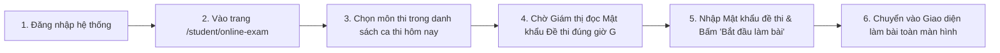

# 02. HƯỚNG DẪN LÀM BÀI THI TRỰC TUYẾN TỪ A ĐẾN Z (ONLINE EXAM)

Tài liệu này hướng dẫn chi tiết từng bước cho Sinh viên khi tham gia làm bài thi trực tuyến tại phân hệ **Thi Trực Tuyến (`/student/online-exam`)**.

---

## 🛠️ 1. Chuẩn Bị Trước Giờ Làm Bài (Pre-Exam Checklist)

Để buổi thi diễn ra thuận lợi, không gặp trục trặc kỹ thuật, bạn cần chuẩn bị:
1. **Thiết bị & Đường truyền**:
   - Sử dụng máy tính bàn (PC) hoặc Laptop có bàn phím và chuột hoạt động tốt.
   - Kết nối mạng dây mạng LAN ổn định (nếu thi tại phòng máy trường) hoặc Wi-Fi tốc độ cao và ổn định.
   - Kiểm tra pin laptop hoặc cắm sạc trực tiếp trong suốt buổi thi.
2. **Trình duyệt khuyến nghị**:
   - Sử dụng **Google Chrome** hoặc **Microsoft Edge** phiên bản mới nhất.
   - Đăng xuất toàn bộ các tài khoản mạng xã hội (Facebook, Zalo, Discord, Telegram).
   - Tắt các tiện ích mở rộng (Extensions) dịch tự động hoặc tiện ích chặn quảng cáo để tránh xung đột mã JavaScript.
3. **Thời gian có mặt**:
   - Đăng nhập vào hệ thống trước giờ bắt đầu làm bài **15 phút**.

---

## 🔑 2. Vào Phòng Thi Ảo & Mở Đề Thi Bằng Mật Khẩu



### Các bước mở đề:
1. Truy cập menu **"Vào Phòng Thi"** (`/student/online-exam`).
2. Chọn đúng môn thi theo lịch thi hôm nay.
3. Màn hình sẽ hiển thị thông tin ca thi: Tên môn học, Thời lượng làm bài (ví dụ: *60 phút*), Tổng số câu hỏi (ví dụ: *40 câu*).
4. Khi Giám thị đọc hoặc công bố **Mật khẩu đề thi**, bạn nhập chính xác mật khẩu vào ô quy định (chú ý chữ hoa, chữ thường và ký tự đặc biệt).
5. Nhấn nút **"Bắt đầu làm bài"**.

---

## 🖥️ 3. Làm Quen Giao Diện Phòng Thi Trực Tuyến

Giao diện làm bài được thiết kế trực quan và tập trung tối đa cho thí sinh:

```
+---------------------------------------------------------------------------------------+
|  📚 MÔN: CƠ SỞ DỮ LIỆU | THÍ SINH: NGUYỄN VĂN AN (SBD: 0045)  | ⏱️ THỜI GIAN: 45:30    |
+---------------------------------------------------------------------------------------+
|  [CÂU HỎI 14 / 40]                                         |  BẢNG CÂU HỎI (PALETTE)   |
|  Cho quan hệ R(A, B, C, D) với các phụ thuộc hàm F = ...   |  [01] [02] [03] [04] [05] |
|  Khóa chính tối thiểu của quan hệ R là gì?                 |  [06] [07] [08] [09] [10] |
|                                                            |  [11] [12] [13] [14*][15] |
|  ( ) A. Thuộc tính AB                                      |  [16] [17] [18] [19] [20] |
|  (•) B. Thuộc tính AC (Đang chọn)                          |  [21] [22] [23] [24] [25] |
|  ( ) C. Thuộc tính AD                                      |  ...                      |
|  ( ) D. Thuộc tính BCD                                     |  ------------------------ |
|                                                            |  Chú thích màu sắc:       |
|  [ 🚩 Đặt cờ xem lại sau ]                                 |  🟦 Xanh: Đã trả lời (28) |
|  [ <- Câu trước ]              [ Câu tiếp theo -> ]        |  ⬜ Xám: Chưa làm (12)    |
|                                                            |  🚩 Cờ: Cần xem lại (3)   |
|                                                            |  ------------------------ |
|                                                            |  [ 📤 NỘP BÀI THI NGAY ]  |
+---------------------------------------------------------------------------------------+
```

### Các thành phần chính:
1. **Đồng hồ đếm ngược (Countdown Timer)**:
   - Hiển thị thời gian còn lại từng giây.
   - Khi thời gian còn dưới 5 phút, đồng hồ sẽ nhấp nháy màu đỏ để nhắc bạn chuẩn bị kiểm tra lại bài.
2. **Bảng ma trận câu hỏi (Question Palette)**:
   - Giúp bạn biết chính xác mình đã làm được bao nhiêu câu và câu nào còn sót.
   - Bấm vào bất kỳ ô số nào để nhảy nhanh đến câu hỏi đó mà không cần bấm nút qua trang nhiều lần.
3. **Tính năng Đặt cờ (Flag for Review)**:
   - Nếu gặp câu hỏi khó cần suy nghĩ thêm, hãy bấm **"Đặt cờ xem lại"**. Ô số đó sẽ có biểu tượng lá cờ đỏ nhắc bạn quay lại trước khi nộp bài.
4. **Cơ chế Tự Động Lưu Đáp Án (Auto-Save)**:
   - Ngay khi bạn nhấp chọn một đáp án A, B, C hoặc D, hệ thống lập tức lưu lựa chọn của bạn vào bộ nhớ máy và đồng bộ lên server. Bạn **không cần bấm nút Lưu** thủ công.

---

## 📤 4. Quy Trình Nộp Bài Thi (Submission)

### Trường hợp 1: Chủ động nộp bài khi đã làm xong:
1. Sau khi hoàn thành và kiểm tra kỹ các câu hỏi, nhấn nút **"Nộp bài thi"**.
2. **Bảng xác nhận nộp bài** xuất hiện thông báo rõ ràng:
   - *"Bạn đã trả lời: 38 / 40 câu hỏi."*
   - *"Còn 2 câu chưa trả lời. Bạn có chắc chắn muốn nộp bài sớm?"*
3. Nếu muốn kiểm tra tiếp, bấm **"Tiếp tục làm bài"**.
4. Nếu chắc chắn nộp, bấm **"Xác nhận nộp bài"**.

### Trường hợp 2: Tự động nộp bài khi hết giờ:
* Khi đồng hồ đếm ngược điểm về `00:00:00`, màn hình sẽ tự động khóa lại ngay lập tức.
* Hệ thống tự động thu toàn bộ các câu trả lời bạn đã chọn và gửi lên máy chủ an toàn.

---

## 🎯 5. Xem Kết Quả Bài Làm

* **Đối với môn thi trắc nghiệm 100%**: Ngay sau khi nộp bài thành công, màn hình sẽ hiển thị thông báo chúc mừng kèm **Tổng số câu đúng** và **Điểm trắc nghiệm tạm tính**.
* **Đối với môn thi có phần tự luận**: Điểm trắc nghiệm sẽ được ghi nhận trước; điểm tổng kết chính thức sẽ được công bố sau khi Thầy/Cô hoàn thành chấm phần tự luận.
