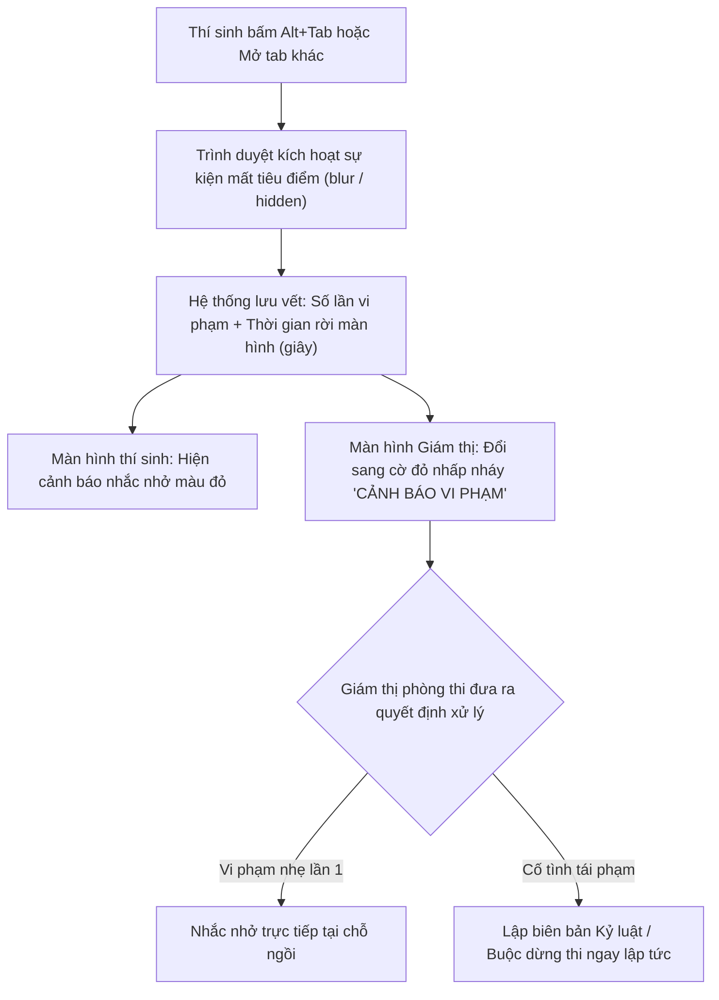

# 03. QUY CHẾ PHÒNG THI TRỰC TUYẾN & HƯỚNG DẪN XỬ LÝ SỰ CỐ KỸ THUẬT

Tài liệu này cung cấp các quy định bắt buộc về kỷ luật phòng thi, cơ chế chống gian lận tự động và hướng dẫn xử lý khi gặp sự cố kỹ thuật (rớt mạng, đơ máy tính, mất điện) dành cho Sinh viên.

---

## 🚫 1. Các Hành Vi Nghiêm Cấm Tuyệt Đối Trong Giờ Thi

Nhằm đảm bảo sự công bằng và nghiêm túc, phần mềm khảo thí trang bị hệ thống giám sát tự động. Thí sinh **TUYỆT ĐỐI KHÔNG** thực hiện các hành vi sau:

1. **Rời khỏi cửa sổ bài thi**: Không mở thêm tab mới trên trình duyệt, không mở các cửa sổ ứng dụng khác, không sử dụng phím tắt chuyển cửa sổ (`Alt + Tab`, phím `Windows`).
2. **Sử dụng công cụ trợ giúp AI hoặc tra cứu tài liệu**: Nghiêm cấm mở ChatGPT, Google Search, từ điển hoặc mở file tài liệu lưu sẵn trên ổ cứng máy tính.
3. **Mở công cụ lập trình viên (Developer Tools)**: Tuyệt đối không bấm phím `F12`, `Ctrl + Shift + I` hoặc click chuột phải chọn "Kiểm tra phần tử" (Inspect Element). Mọi hành vi này đều bị hệ thống ghi nhận là cố ý can thiệp mã nguồn đề thi.
4. **Sử dụng thiết bị ngoại vi trái phép**: Không đeo tai nghe, không nhìn vào điện thoại di động, không sử dụng phần mềm điều khiển từ xa (TeamViewer, UltraViewer, AnyDesk).

---

## 👁️ 2. Cơ Chế Bắt Gian Lận Tự Động Hoạt Động Như Thế Nào?

### Các mức độ xử lý kỷ luật theo quy chế:
* **Khiển trách**: Áp dụng đối với thí sinh vi phạm 1 lần nhưng chưa gây hậu quả nghiêm trọng. Bị **trừ 25% tổng điểm** của bài thi.
* **Cảnh cáo**: Áp dụng đối với thí sinh cố tình tái phạm chuyển tab hoặc trao đổi bài sau khi đã bị nhắc nhở. Bị **trừ 50% tổng điểm** của bài thi.
* **Đình chỉ thi**: Áp dụng đối với thí sinh nhờ người thi hộ, sử dụng tài liệu trái phép hoặc có hành vi gian lận nghiêm trọng. Nhận **điểm 0 (Không)** cho môn thi đó và bị xử lý kỷ luật theo quy chế học vụ của nhà trường.

---

## 🛠️ 3. Sổ Tay Xử Lý Sự Cố Kỹ Thuật Dành Cho Sinh Viên (Troubleshooting)

Trong quá trình thi trực tuyến, nếu gặp phải sự cố kỹ thuật ngoài ý muốn, bạn hãy **HẾT SỨC BÌNH TĨNH** và thực hiện theo đúng chỉ dẫn dưới đây:

### Sự cố 1: Máy tính bị mất mạng internet tạm thời
* **Hiện tượng**: Màn hình xuất hiện thông báo màu vàng: *"Mất kết nối máy chủ, đang thử kết nối lại..."*
* **Cách xử lý**:
  - **TUYỆT ĐỐI KHÔNG TẮT TRÌNH DUYỆT!**
  - Hệ thống khảo thí được trang bị công nghệ **Bộ nhớ đệm dự phòng (Local Cache)**. Mọi đáp án bạn đã chọn trước đó vẫn được lưu an toàn 100% trên máy tính của bạn.
  - Bạn vẫn có thể tiếp tục đọc và chọn đáp án cho các câu tiếp theo.
  - Giữ nguyên màn hình, khi đường truyền internet khôi phục trở lại, hệ thống sẽ tự động đồng bộ ngầm toàn bộ bài làm lên máy chủ mà không làm mất bài của bạn.

### Sự cố 2: Máy tính bị đơ (treo máy), sập nguồn hoặc mất điện đột ngột
* **Hiện tượng**: Máy tính tự khởi động lại hoặc đứng hình hoàn toàn không di chuyển được chuột.
* **Cách xử lý**:
  1. **Lập tức giơ tay báo cáo Giám thị phòng thi** để được ghi nhận thời điểm gặp sự cố.
  2. Giám thị sẽ chuyển bạn sang một máy tính dự phòng khác trong phòng thi hoặc khởi động lại máy tính hiện tại.
  3. Mở lại trình duyệt và đăng nhập lại đúng tài khoản của bạn.
  4. Vào lại ca thi: **Toàn bộ tiến trình làm bài, các câu hỏi đã chọn trước thời điểm gặp sự cố sẽ được khôi phục nguyên vẹn 100%** từ máy chủ.
  5. Giám thị sẽ dùng quyền can thiệp để **Cộng bù thêm thời gian** tương ứng với số phút bạn bị gián đoạn do sự cố máy tính. Bạn hoàn toàn không bị thiệt thòi về thời gian làm bài!
