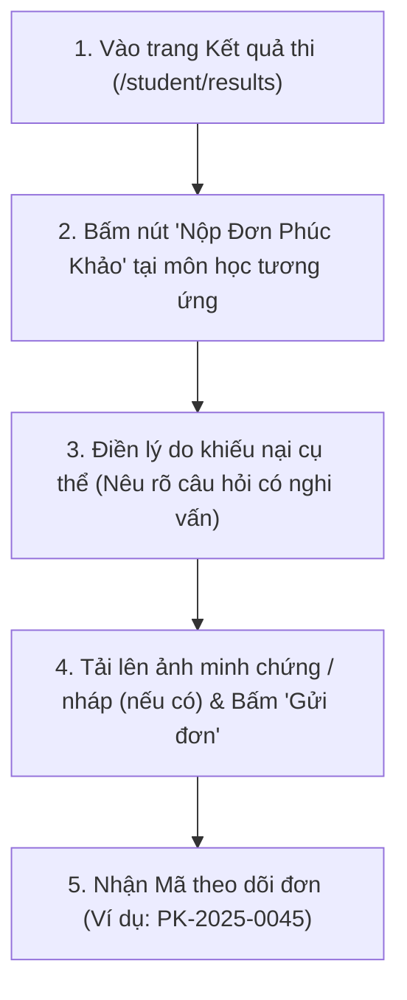

# 05. HƯỚNG DẪN NỘP ĐƠN PHÚC KHẢO ĐIỂM THI TRỰC TUYẾN

Tài liệu này hướng dẫn Sinh viên quy trình làm và nộp đơn xin chấm thẩm định lại bài thi (Phúc khảo điểm thi) hoàn toàn trực tuyến trên hệ thống mà không cần phải nộp đơn giấy tại văn phòng khoa.

---

## ⏱️ 1. Điều Kiện & Thời Hạn Nộp Đơn Phúc Khảo

* **Khi nào bạn nên nộp đơn phúc khảo?**
  - Khi bạn nhận thấy điểm số công bố có sự chênh lệch lớn so với kết quả bài làm thực tế của mình.
  - Khi bạn nghi vấn có sự nhầm lẫn trong quá trình nhập điểm hoặc cộng sót điểm ở phần tự luận.
* **Thời hạn nộp đơn**:
  - Chức năng nộp đơn phúc khảo chỉ mở trong vòng **05 đến 07 ngày** kể từ ngày Ban Khảo thí chính thức công bố điểm của môn thi đó.
  - Sau thời hạn quy định, hệ thống sẽ tự động khóa chức năng gửi đơn của môn thi đó để tiến hành tổng kết học kỳ.

---

## 📝 2. Các Bước Nộp Đơn Phúc Khảo Trực Tuyến

### Hướng dẫn điền thông tin phiếu phúc khảo:
1. Đăng nhập hệ thống và vào trang `/student/results`.
2. Tìm đến môn học bạn có thắc mắc về điểm số và bấm nút **"Nộp Đơn Phúc Khảo"**.
3. Form điện tử sẽ hiện ra với các trường:
   - **Môn thi & Điểm số hiện tại**: Hệ thống tự động điền sẵn.
   - **Phần thi muốn phúc khảo**: Chọn *Phần thi Tự luận*, *Phần thi Trắc nghiệm*, hoặc *Toàn bộ bài thi*.
   - **Lý do xin phúc khảo (Bắt buộc)**: Bạn cần trình bày ngắn gọn, lịch sự và nêu rõ căn cứ thắc mắc.
     - *Ví dụ mẫu*: *"Kính gửi Ban Khảo thí và Quý Thầy/Cô bộ môn Cơ sở dữ liệu. Em nhận thấy câu số 3 phần thiết kế câu lệnh SQL em đã viết đầy đủ mệnh đề GROUP BY và HAVING đúng theo yêu cầu của đề bài, nhưng chỉ được 0.5/2.0 điểm. Em kính xin Quý Thầy/Cô kiểm tra và chấm thẩm định lại giúp em. Em xin chân thành cảm ơn!"*
   - **File minh chứng đính kèm (Tùy chọn)**: Tải lên hình ảnh hoặc tài liệu liên quan nếu cần.
4. Nhấn nút **"Xác Nhận & Gửi Đơn Phúc Khảo"**.

---

## 🔍 3. Theo Dõi Tiến Độ Giải Quyết Đơn Của Bạn

Sau khi gửi đơn, bạn có thể kiểm tra trạng thái xử lý bất cứ lúc nào tại tab **"Lịch Sử Phúc Khảo"**:

* 🟡 **Đã tiếp nhận (PENDING)**: Đơn của bạn đã vào hệ thống, đang chờ Ban Khảo thí phân công 2 giảng viên thẩm định độc lập.
* 🔵 **Đang thẩm định (IN_REVIEW)**: Hội đồng chấm thi đang mở lại bài làm gốc của bạn và tiến hành chấm lại theo barem Rubric.
* 🟢 **Đã có kết luận (RESOLVED)**: Đơn đã được giải quyết xong. Màn hình sẽ hiển thị rõ:
  - **Kết quả**: *Tăng điểm* (kèm điểm số mới), *Giữ nguyên điểm*, hoặc *Hạ điểm*.
  - **Biên bản giải trình của Thầy/Cô**: Giải thích chi tiết lý do vì sao điểm thay đổi hoặc vì sao giữ nguyên điểm.
  - Bảng điểm chính thức của bạn sẽ tự động được cập nhật ngay lập tức.
