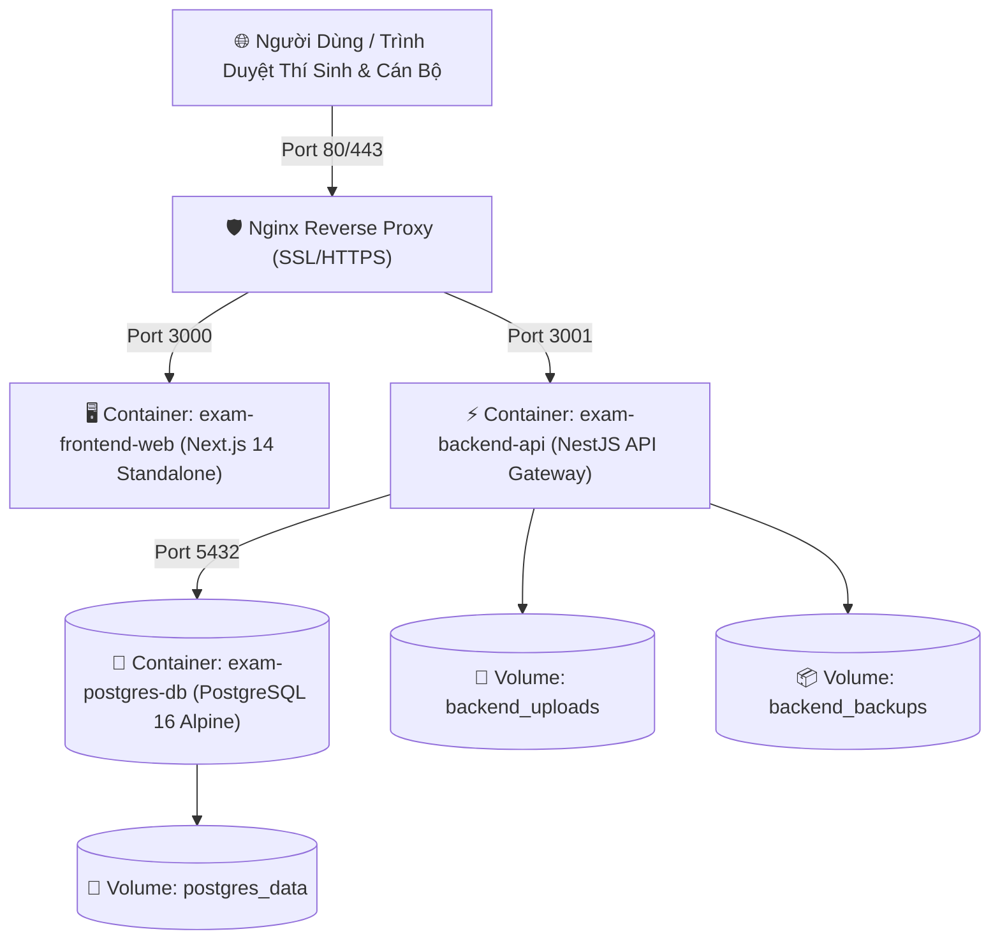

# 02. HƯỚNG DẪN TRIỂN KHAI & VẬN HÀNH HỆ THỐNG BẰNG DOCKER

Tài liệu này hướng dẫn Kỹ sư DevOps triển khai Hệ thống Khảo thí bằng công nghệ container hóa **Docker** và **Docker Compose**, giúp hệ thống vận hành cô lập, ổn định và dễ dàng mở rộng.

---

## 🐳 1. Mô Hình Các Dịch Vụ Container (Architecture)

Hệ thống được đóng gói thành cụm 3 container liên kết nội bộ trong mạng riêng `exam-network`:



---

## 🚀 2. Các Lệnh Điều Hành Docker Nhanh

Tại thư mục gốc dự án (`exam-management/`), bạn có thể sử dụng các lệnh script có sẵn trong `package.json`:

| Thao tác | Lệnh NPM viết tắt | Lệnh Docker Compose gốc |
| :--- | :--- | :--- |
| **Khởi chạy ngầm toàn bộ** | `npm run docker:up` | `docker compose up -d` |
| **Dừng & Hủy container** | `npm run docker:down` | `docker compose down` |
| **Đóng gói lại Image (Build)** | `npm run docker:build` | `docker compose build` |
| **Xem Log trực tiếp (Live Logs)** | - | `docker compose logs -f` |
| **Xem Log riêng Backend** | - | `docker compose logs -f backend` |
| **Xem Trạng thái các container** | - | `docker compose ps` |

---

## 💾 3. Quản Lý Dữ Liệu Tồn Tại Lâu Dài (Persistent Volumes)

Để dữ liệu không bao giờ bị mất khi khởi động lại hoặc cập nhật phiên bản container mới, 3 volume chuyên dụng được liên kết với máy chủ chủ (Host Machine):

1. **`postgres_data`**: Lưu trữ toàn bộ bảng biểu, tài khoản, điểm số của PostgreSQL tại `/var/lib/postgresql/data`. Tuyệt đối không xóa volume này trừ khi muốn làm mới hoàn toàn hệ thống.
2. **`backend_uploads`**: Lưu trữ các file đính kèm, ảnh chụp minh chứng đề thi, bài làm tự luận của sinh viên.
3. **`backend_backups`**: Nơi lưu các file backup `.sql` tự động do worker sinh ra. Kỹ sư IT có thể copy dữ liệu từ thư mục này sang ổ đĩa ngoài định kỳ.

---

## 🩺 4. Kiểm Tra Sức Khỏe & Truy Cập Container (Healthcheck & Exec)

### Kiểm tra cơ sở dữ liệu PostgreSQL đã sẵn sàng chưa:
Container `exam-postgres-db` có tích hợp cơ chế Healthcheck tự động:
```bash
docker exec -it exam-postgres-db pg_isready -U postgres -d exam
```
*Kết quả trả về: `exam:5432 - accepting connections` nghĩa là CSDL đang hoạt động hoàn hảo.*

### Mở dòng lệnh Terminal bên trong Container Backend:
Khi cần chạy các lệnh đặc biệt như seed dữ liệu hoặc kiểm tra log file:
```bash
docker exec -it exam-backend-api sh

# Chạy seed dữ liệu thủ công bên trong container:
npm run seed
```

---

## 🔒 5. Cấu Hình Nginx Reverse Proxy & Chứng Chỉ SSL HTTPS

Khi triển khai trên máy chủ thật có tên miền chính thức (Ví dụ: `khaothi.truongdaihoc.edu.vn`), khuyến nghị thiết lập cấu hình Nginx phía trước:

```nginx
server {
    listen 80;
    server_name khaothi.truongdaihoc.edu.vn;
    return 301 https://$host$request_uri;
}

server {
    listen 443 ssl http2;
    server_name khaothi.truongdaihoc.edu.vn;

    ssl_certificate /etc/letsencrypt/live/khaothi.truongdaihoc.edu.vn/fullchain.pem;
    ssl_certificate_key /etc/letsencrypt/live/khaothi.truongdaihoc.edu.vn/privkey.pem;

    # Chuyển tiếp các request thông thường về Frontend Next.js
    location / {
        proxy_pass http://127.0.0.1:3000;
        proxy_http_version 1.1;
        proxy_set_header Upgrade $http_upgrade;
        proxy_set_header Connection 'upgrade';
        proxy_set_header Host $host;
        proxy_cache_bypass $http_upgrade;
    }

    # Chuyển tiếp các request API hoặc WebSocket về Backend NestJS
    location /api/ {
        proxy_pass http://127.0.0.1:3001/;
        proxy_http_version 1.1;
        proxy_set_header Upgrade $http_upgrade;
        proxy_set_header Connection "Upgrade";
        proxy_set_header Host $host;
        proxy_set_header X-Real-IP $remote_addr;
        proxy_set_header X-Forwarded-For $proxy_add_x_forwarded_for;
        proxy_read_timeout 300s;
    }
}
```

> [!TIP]
> Sử dụng công cụ miễn phí **Certbot** (`certbot --nginx -d khaothi.truongdaihoc.edu.vn`) để tự động cài đặt và gia hạn chứng chỉ bảo mật SSL Let's Encrypt 90 ngày một lần.
