# 📖 CẨM NANG HƯỚNG DẪN SỬ DỤNG HỆ THỐNG KHẢO THÍ (EXAM MANAGEMENT SYSTEM)

Chào mừng bạn đến với bộ tài liệu hướng dẫn sử dụng chính thức của **Hệ Thống Quản Lý Khảo Thí Sinh Viên Toàn Diện**. Tài liệu này được biên soạn chi tiết theo từng vai trò người dùng, quy trình nghiệp vụ và tiêu chuẩn vận hành thực tế tại các trường đại học, cao đẳng và học viện.

---

## 🗺️ Bản Đồ Điều Hướng Tài Liệu

Bộ tài liệu được chia thành 5 phân hệ chuyên biệt:

```mermaid
graph TD
    Root["📖 Cẩm Nang Hướng Dẫn Sử Dụng"] --> Overview["00. Tổng Quan Hệ Thống & Kiến Trúc"]
    Root --> AdminGuide["01. Cẩm Nang Quản Trị Viên & Khảo Thí"]
    Root --> TeacherGuide["02. Cẩm Nang Giảng Viên / Cán Bộ Coi Thi & Chấm Thi"]
    Root --> StudentGuide["03. Cẩm Nang Thí Sinh / Sinh Viên"]
    Root --> ITGuide["04. Sổ Tay Kỹ Thuật & Vận Hành Hệ Thống (IT/DevOps)"]

    AdminGuide --> A1["Phân quyền & RBAC"]
    AdminGuide --> A2["Quản lý Đào tạo"]
    AdminGuide --> A3["Tổ chức Kỳ thi"]
    AdminGuide --> A4["Xếp phòng & SBD"]
    AdminGuide --> A5["Ngân hàng Đề & Câu hỏi"]
    AdminGuide --> A6["Tổng hợp Báo cáo"]
    AdminGuide --> A7["Sao lưu & Nhật ký"]

    TeacherGuide --> T1["Không gian Giảng viên"]
    TeacherGuide --> T2["Lịch coi thi"]
    TeacherGuide --> T3["Giám sát Trực tuyến"]
    TeacherGuide --> T4["Chấm thi Tự luận & AI"]
    TeacherGuide --> T5["Xử lý Phúc khảo"]

    StudentGuide --> S1["Tra cứu Lịch thi & SBD"]
    StudentGuide --> S2["Quy trình Thi trực tuyến"]
    StudentGuide --> S3["Quy chế & Chống gian lận"]
    StudentGuide --> S4["Xem Kết quả & Bảng điểm"]
    StudentGuide --> S5["Nộp đơn Phúc khảo"]

    ITGuide --> I1["Cài đặt Môi trường"]
    ITGuide --> I2["Triển khai Docker"]
    ITGuide --> I3["Xử lý Sự cố (Runbook)"]
```

---

## 📑 Danh Mục Bài Viết Chi Tiết

### 🌟 [00. Giới Thiệu Tổng Quan Hệ Thống](./00-tong-quan-he-thong.md)
* Giới thiệu mục tiêu, kiến trúc công nghệ (Next.js 14, NestJS, PostgreSQL).
* Mô hình phân vai người dùng: Admin, Giảng viên, Sinh viên.
* Bảng tài khoản mẫu phục vụ kiểm thử và diễn tập.
* Sơ đồ luồng nghiệp vụ khảo thí khép kín từ khâu lập kế hoạch đến công bố điểm.

---

### 👑 [01. Cẩm Nang Quản Trị Viên & Phòng Khảo Thí (Admin)](./01-huong-dan-admin/)
Tài liệu hướng dẫn dành cho Ban Giám hiệu, Lãnh đạo Phòng Khảo thí & Đảm bảo chất lượng:
1. **[01. Đăng nhập, Bảo mật & Ma trận Phân quyền (RBAC)](./01-huong-dan-admin/01-dang-nhap-va-phan-quyen.md)**: Thiết lập quyền vai trò, quyền riêng tài khoản (`ALLOW`/`DENY`), giới hạn phạm vi dữ liệu theo Khoa/Lớp/Môn, truy vết lịch sử phân quyền.
2. **[02. Quản lý Dữ liệu Đào tạo](./01-huong-dan-admin/02-quan-ly-dao-tao.md)**: Quản trị danh mục Khoa/Viện, Ngành, Lớp học, Môn học, Hồ sơ Giảng viên và Danh sách Sinh viên; nhập/xuất dữ liệu Excel hàng loạt.
3. **[03. Tổ chức Kỳ thi & Lập Lịch thi](./01-huong-dan-admin/03-to-chuc-ky-thi.md)**: Khởi tạo Đợt thi (`exam-periods`), Danh mục Phòng thi (`exam-rooms`), Lịch thi môn học (`exam-schedules`) và thuật toán chống trùng ca thi tự động.
4. **[04. Xếp Phòng thi & Phân công Giám thị Tự động](./01-huong-dan-admin/04-xep-phong-va-phan-cong.md)**: Động cơ xếp phòng thi (`exam-arrangement`), sinh Số báo danh (SBD), phân bổ số ghế, phân công Giám thị 1 & Giám thị 2 không trùng giờ.
5. **[05. Ngân hàng Câu hỏi & Tạo Đề thi Ma trận](./01-huong-dan-admin/05-ngan-hang-cau-hoi-de-thi.md)**: Quản lý câu hỏi trắc nghiệm/tự luận, phê duyệt câu hỏi, cấu hình ma trận đề (Dễ/TB/Khó), sinh đề tự động và đặt mã bảo mật đề thi.
6. **[06. Trung tâm Tổng báo cáo & Xuất Thống kê](./01-huong-dan-admin/06-tong-hop-va-xuat-bao-cao.md)**: Khai thác Trung tâm Báo cáo (`/exam-reports`), thống kê phổ điểm, tiến độ chấm thi, tình hình dự thi, xuất file Excel XLSX/CSV UTF-8 BOM chuẩn tiếng Việt.
7. **[07. Quản trị Sao lưu Dữ liệu & Nhật ký Hệ thống](./01-huong-dan-admin/07-sao-luu-va-nhat-ky.md)**: Cơ chế sao lưu tự động/thủ công CSDL (`/admin/backups`), khôi phục dữ liệu an toàn, giám sát Audit Logs và quản lý Thùng rác (`/trash`).

---

### 👨‍🏫 [02. Cẩm Nang Giảng Viên & Cán Bộ Coi Thi / Chấm Thi](./02-huong-dan-giang-vien/)
Tài liệu hướng dẫn dành cho Thầy/Cô tham gia công tác tổ chức thi và chuyên môn:
1. **[01. Tổng quan Không gian Làm việc Giảng viên](./02-huong-dan-giang-vien/01-tong-quan-giao-dien.md)**: Làm quen giao diện, phạm vi dữ liệu được phân quyền, thanh điều hướng nhanh.
2. **[02. Tra cứu Lịch Coi thi & Danh sách Phòng thi](./02-huong-dan-giang-vien/02-lich-coi-thi-phan-cong.md)**: Xem ca coi thi được phân công (`/teacher/assignments`), tải và in danh sách thí sinh, kiểm diện đầu giờ.
3. **[03. Giám sát Phòng thi Trực tuyến Thời gian Thực (Proctoring)](./02-huong-dan-giang-vien/03-giam-sat-phong-thi.md)**: Giám sát thí sinh làm bài trực tuyến (`/teacher/proctor`), phát hiện gian lận rời màn hình, gửi cảnh báo, cộng giờ làm bài, đình chỉ/khóa bài thi.
4. **[04. Chấm thi Tự luận Kết hợp Trợ lý AI](./02-huong-dan-giang-vien/04-cham-thi-tu-luan.md)**: Giao diện chấm tự luận (`/teacher/essay-grading`), chấm theo khung tiêu chí Rubric, tham khảo điểm gợi ý từ AI (Gemini / DeepSeek), chốt điểm và nhập nhận xét.
5. **[05. Tiếp nhận & Giải quyết Đơn Phúc khảo](./02-huong-dan-giang-vien/05-giai-quyet-phuc-khao.md)**: Quy trình xem xét đơn phúc khảo (`/teacher/regrade`), chấm thẩm định lại bài thi và cập nhật biên bản phúc khảo.

---

### 🎓 [03. Cẩm Nang Thí Sinh / Sinh Viên](./03-huong-dan-sinh-vien/)
Tài liệu hướng dẫn dành cho Sinh viên tham gia kỳ thi:
1. **[01. Tra cứu Lịch thi, Phòng thi & Số Báo Danh](./03-huong-dan-sinh-vien/01-tra-cuu-lich-thi.md)**: Xem thông tin ca thi cá nhân (`/student/exam-schedule`), chuẩn bị phòng thi và luyện tập trắc nghiệm tự do (`/practice`).
2. **[02. Hướng dẫn Làm Bài thi Trực tuyến Từ A-Z](./03-huong-dan-sinh-vien/02-huong-dan-thi-truc-tuyen.md)**: Các bước chuẩn bị thiết bị, đăng nhập, nhập mã đề/mật khẩu, giao diện làm bài trắc nghiệm và tự luận, tự động lưu câu trả lời, xác nhận nộp bài.
3. **[03. Quy chế Phòng thi & Quy định Chống gian lận](./03-huong-dan-sinh-vien/03-quy-che-va-chong-gian-lan.md)**: Quy tắc nghiêm cấm chuyển tab/chuyển cửa sổ, camera giám sát, cơ chế tự động bảo vệ bài làm khi gặp sự cố rớt mạng hoặc mất điện.
4. **[04. Tra cứu Kết quả Thi & Bảng điểm Cá nhân](./03-huong-dan-sinh-vien/04-xem-ket-qua-va-bang-diem.md)**: Xem bảng điểm chi tiết theo môn, đối chiếu câu đúng/sai (nếu môn thi cho phép), xem nhận xét của giảng viên.
5. **[05. Quy trình Nộp đơn Phúc khảo Trực tuyến](./03-huong-dan-sinh-vien/05-nop-don-phuc-khao.md)**: Hướng dẫn viết lý do phúc khảo, gửi đơn trực tuyến và theo dõi tiến độ xử lý đơn khiếu nại điểm thi.

---

### 🛠️ [04. Sổ Tay Kỹ Thuật & Vận Hành Hệ Thống (DevOps / IT)](./04-huong-dan-ky-thuat-it/)
Tài liệu hướng dẫn dành cho Kỹ sư hệ thống và Quản trị viên máy chủ:
1. **[01. Hướng dẫn Cài đặt & Cấu hình Môi trường](./04-huong-dan-ky-thuat-it/01-cai-dat-moi-truong.md)**: Cài đặt Node.js, PostgreSQL, Prisma ORM, cấu hình file biến môi trường `.env`.
2. **[02. Vận hành & Triển khai Hệ thống Bằng Docker](./04-huong-dan-ky-thuat-it/02-van-hanh-docker.md)**: Sử dụng Docker Compose, cấu hình proxy, phân bổ tài nguyên và volume lưu trữ.
3. **[03. Xử lý Sự cố & Quy trình Phục hồi Dữ liệu (Runbook)](./04-huong-dan-ky-thuat-it/03-khac-phuc-su-co.md)**: Khắc phục lỗi crash backend, nghẽn mạng ca thi, rà soát kết nối cơ sở dữ liệu và khôi phục database từ file backup.

---

> [!NOTE]
> Để tài liệu luôn phản ánh chính xác nhất tính năng phần mềm, mọi bài viết đều được cập nhật song song với từng bản phát hành chính thức của hệ thống. Nếu có thắc mắc hoặc đề xuất cải tiến, vui lòng liên hệ Ban Quản Trị Hệ Thống.
