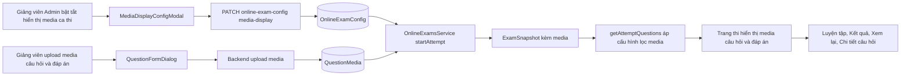

# Kế hoạch: Tính năng Media câu hỏi (Ảnh / Video / Âm thanh) + Thiết lập hiển thị ở trang thi

## 1. Bối cảnh và Hiện trạng

Hệ thống đã có **nền tảng media cơ bản** nhưng chưa được kết nối đầy đủ tới luồng thi thật:

| Thành phần | Hiện trạng | Kết luận |
|---|---|---|
| Schema `QuestionMedia` (questionId + optionId?) | Đã có, migration `20260805120000_add_question_rich_content_media` đã áp dụng | ✅ Nền tảng đủ |
| Backend upload/preview/delete media | `POST /questions/media/upload` (10 file, 50MB), `POST /questions/media/preview`, `DELETE /questions/media/:id` | ✅ Đã có |
| Upload media cấp câu hỏi (UI) | `QuestionFormDialog` có "Đính kèm media" | ✅ Đã có |
| Upload media cấp đáp án (UI) | **Không có** | ❌ Thiếu |
| Hiển thị media ở trang thi (question) | Trang take render `currentQ.media` nhưng backend `getAttemptQuestions` **KHÔNG trả media** → mã chết | ❌ Lỗi trọng yếu |
| Hiển thị media đáp án ở trang thi | **Không render** `opt.media` | ❌ Thiếu |
| Thiết lập hiển thị media trong `OnlineExamConfig` | **Không có field** nào | ❌ Thiếu |
| Giao diện cấu hình ca thi | **Không có** | ❌ Thiếu |
| Media ở trang luyện tập / kết quả / xem lại | **Không render** | ❌ Thiếu |
| Endpoint ADMIN/TEACHER cập nhật config | Chỉ có `PATCH /online-exam-config/:scheduleId/essay` (mẫu có sẵn) | ⚠️ Cần thêm |

### Lỗi trọng yếu cần sửa
- [`getAttemptQuestions()`](backend/src/online-exams/online-exams.service.ts:338) loại bỏ `media` và `contentRich` khỏi `clientQuestions`, trong khi trang thi render `currentQ.media` và `currentQ.contentRich` ([`page.tsx`](frontend/app/student/online-exam/[id]/take/page.tsx:594)). → Media **không bao giờ tới được trang thi**.
- `startAttempt()` tạo snapshot (`snapshotData`) cũng **không chứa media/contentRich** ([`online-exams.service.ts`](backend/src/online-exams/online-exams.service.ts:216)) → cần đưa media vào snapshot để đảm bảo tính toàn vẹn (media đóng băng tại thời điểm bắt đầu thi).

## 2. Mục tiêu

1. Cho phép giảng viên/Admin **bật/tắt từng loại media** (Ảnh / Video / Âm thanh) cho từng ca thi.
2. Sinh viên thấy đầy đủ ảnh/video/audio **của câu hỏi và đáp án** ở trang thi theo đúng cấu hình.
3. Các trang liên quan (Luyện tập, Kết quả, Xem lại bài làm, Chi tiết câu hỏi) hiển thị media đồng bộ.

## 3. Phạm vi

- **Không** đổi logic chấm điểm, không đổi cấu trúc bảng `QuestionMedia`.
- Không thay đổi luồng bảo mật hiện tại (snapshot vẫn lọc `isCorrect` khi trả client).
- Media upload cấp câu hỏi **giữ nguyên**; chỉ **thêm** upload cấp đáp án.

## 4. Thay đổi chi tiết

### 4.1 Database — Prisma migration mới

Thêm 3 field Boolean vào model `OnlineExamConfig` ([`schema.prisma`](backend/prisma/schema.prisma:557)):

```prisma
showImages  Boolean @default(true)  // Hiển thị ảnh
showVideos  Boolean @default(true)  // Hiển thị video
showAudios  Boolean @default(true)  // Hiển thị âm thanh
```

> Một toggle áp dụng cho cả media cấp câu hỏi và cấp đáp án cùng loại (đơn giản, đúng ý "bật/tắt từng loại media").
> Migration mới: `20260808_add_media_display_config` — **cần xác nhận trước khi chạy** (theo GEMINI.md).

### 4.2 Backend

**a) Endpoint cấu hình ca thi** (mô phỏng theo [`EssayConfigController`](backend/src/essay/essay-config.controller.ts:11)):

- Thêm route: `PATCH /online-exam-config/:scheduleId/media-display` — role `ADMIN`, `TEACHER`.
- DTO: `{ showImages?: boolean; showVideos?: boolean; showAudios?: boolean }`.
- Service `updateMediaDisplayConfig(actor, scheduleId, dto)`:
  - Kiểm tra quyền truy cập lịch thi (giống `teacherCanAccessSchedule` của essay).
  - `upsert` config theo `examScheduleId` (mặc định `examPaperId` lấy đề PUBLISHED gần nhất nếu config chưa tồn tại).
  - Ghi audit log.
- Trả về config mới để UI refresh.

**b) Đưa media vào snapshot** — [`startAttempt()`](backend/src/online-exams/online-exams.service.ts:187):

- Thêm `media: true` và `contentRich: true` vào `include.question` (và `include.question.options` thêm `media: true`).
- Trong `snapshotData`, map thêm:
  - `contentRich: pq.question.contentRich`
  - `media: pq.question.media` (mảng đối tượng media câu hỏi)
  - `options`: thêm `media: opt.media` và `contentRich: opt.contentRich`

**c) Trả media về client khi thi** — [`getAttemptQuestions()`](backend/src/online-exams/online-exams.service.ts:338):

- Giữ nguyên bọc bảo mật (lọc `isCorrect`).
- Map thêm `contentRich`, `media` cho câu hỏi; `contentRich`, `media` cho từng option.
- **Áp cấu hình hiển thị**: đọc `attempt.onlineExamConfig` (đã include sẵn), lọc `media` theo loại MIME:
  - `showImages=false` → bỏ media `image/*`
  - `showVideos=false` → bỏ media `video/*`
  - `showAudios=false` → bỏ media `audio/*`
- Trả thêm `config.mediaDisplay = { showImages, showVideos, showAudios }` để frontend fallback.

**d) Các luồng khác truyền media qua:**

- [`getAttemptReviewDetails()`](backend/src/online-exams/online-exams.service.ts:843): map `contentRich`, `media` (câu hỏi + option) từ snapshot vào `questionsReview` (snapshot đã có media từ bước b).
- [`getAttemptResult()`](backend/src/online-exams/online-exams.service.ts:735): kiểm tra & bổ sung media nếu result trả danh sách câu hỏi.
- [`PracticeService`](backend/src/practice/practice.service.ts:56): thêm `media` + `contentRich` vào `select` của câu hỏi và option; map vào `session.questions` và response `start` (đã có cấu trúc map ở dòng 87-92).

### 4.3 Frontend

**a) Giao diện cấu hình ca thi — Modal `MediaDisplayConfigModal`** (mới):

- Vị trí: trang `exam-papers` ([`page.tsx`](frontend/app/exam-papers/page.tsx:1062)) — đặt cạnh `ChangeExamPasswordModal`.
- Thêm nút "Cấu hình hiển thị media" (icon Image/Play/Music) trong action của mỗi đề thi trong bảng đề (cạnh nút đổi mật khẩu).
- Modal dùng chuẩn popup đã đồng bộ: `Modal` + header `px-6 py-4`, title `text-base font-bold`, body `p-6`, footer `px-6 py-4`.
- 3 toggle: Hiển thị Ảnh / Video / Âm thanh. Giá trị mặc định đọc từ `sched.onlineExamConfig` (đã có trong data exam-papers); nếu chưa có config → mặc định `true`.
- Lưu qua `PATCH /online-exam-config/:scheduleId/media-display`, hiển thị Toast thành công/theo chuẩn.
- `examScheduleId` lấy từ `paper.examScheduleId ?? sched.id`.

**b) Trang thi** ([`page.tsx`](frontend/app/student/online-exam/[id]/take/page.tsx)):

- Giữ nguyên render media câu hỏi (đã có, giờ backend trả dữ liệu thật).
- **Render media đáp án**: trong vòng lặp option (dòng 675-699), thêm hiển thị `opt.media` giống block media câu hỏi (video controls, audio, ảnh + lightbox).
- Thêm fallback: nếu `attemptData.config.mediaDisplay` báo tắt loại media nào → bỏ qua render (phòng khi backend cũ).

**c) Upload media đáp án — `QuestionFormDialog`** ([`QuestionFormDialog.tsx`](frontend/components/question-bank/QuestionFormDialog.tsx:286)):

- Mỗi dòng option (mảng `fields`) thêm bộ chọn media: input file `accept="image/*,video/mp4,video/webm,audio/*"` + danh sách file chờ upload + nút xóa.
- Trạng thái: `optionMediaFiles: Record<index, File[]>`.
- **Luồng upload**: sau khi tạo/cập nhật câu hỏi thành công (backend trả `question.id` + options có `id` theo thứ tự), gọi upload cho từng option theo index; media câu hỏi giữ nguyên luồng hiện tại.
- Khi chỉnh sửa: nạp media option hiện có (từ `question.options[i].media`) và cho phép thêm/xóa (xóa qua `DELETE /questions/media/:id`).

**d) Các trang liên quan — render media đồng bộ:**

- **Luyện tập** ([`practice/page.tsx`](frontend/app/student/practice/page.tsx)): render media câu hỏi + đáp án (dùng chung pattern media block của trang thi, tách thành component dùng chung nếu tiện).
- **Kết quả thi** ([`result/page.tsx`](frontend/app/student/online-exam/[id]/result/page.tsx)): render media câu hỏi + đáp án.
- **Xem lại bài làm** ([`ExamAttemptReviewModal.tsx`](frontend/components/exam-reports/ExamAttemptReviewModal.tsx:106)): render media trong `QuestionCard` (câu hỏi) và `OptionItem` (đáp án).
- **Chi tiết câu hỏi** ([`QuestionDetailDialog.tsx`](frontend/components/question-bank/QuestionDetailDialog.tsx:115)): thêm render `o.media` cho từng option (hiện chỉ text).

**Gợi ý kiến trúc:** tạo component dùng chung `QuestionMediaGallery` (nhận `media[]`, `lightbox`, kích thước max) đặt tại `frontend/components/shared/QuestionMediaGallery.tsx` để 5 trang dùng chung, tránh lặp code.

## 5. Sơ đồ luồng



## 6. Các bước triển khai (theo thứ tự)

1. Migration Prisma: thêm `showImages`, `showVideos`, `showAudios` vào `OnlineExamConfig` (chờ xác nhận).
2. Backend: DTO + endpoint `PATCH /online-exam-config/:scheduleId/media-display` + service + audit.
3. Backend: thêm media/contentRich vào snapshot (`startAttempt`) và trả về client (`getAttemptQuestions`) + lọc theo cấu hình.
4. Backend: truyền media qua `getAttemptReviewDetails`, `getAttemptResult`, `PracticeService`.
5. Frontend: component dùng chung `QuestionMediaGallery`.
6. Frontend: `MediaDisplayConfigModal` + nút cấu hình ở trang exam-papers.
7. Frontend: render media đáp án ở trang thi + fallback cấu hình.
8. Frontend: upload media đáp án trong `QuestionFormDialog`.
9. Frontend: render media ở Luyện tập / Kết quả / ExamAttemptReviewModal / QuestionDetailDialog.
10. Kiểm tra: `prisma generate`, build backend, `next build`, smoke test luồng thi với media.

## 7. Rủi ro / Lưu ý

- **Tính toàn vẹn snapshot**: media được chụp vào snapshot lúc bắt đầu thi → nếu giảng viên xóa/sửa media sau đó, bài thi đang dở vẫn giữ media gốc. Đúng thiết kế, cần kiểm thử.
- **Kích thước media**: video/audio có thể lớn → đã có giới hạn 50MB/file ở upload; cân nhắc `preload="none"` cho video ở trang thi để tránh tải trước toàn bộ.
- **Thay đổi cấu hình giữa ca thi**: toggle chỉ ảnh hưởng phiên thi mới (snapshot mới), không thay đổi snapshot đã tạo — thống nhất hành vi, ghi chú trong UI.
- **Migrations mới**: cần sự đồng ý của người dùng trước khi chạy (theo GEMINI.md).
